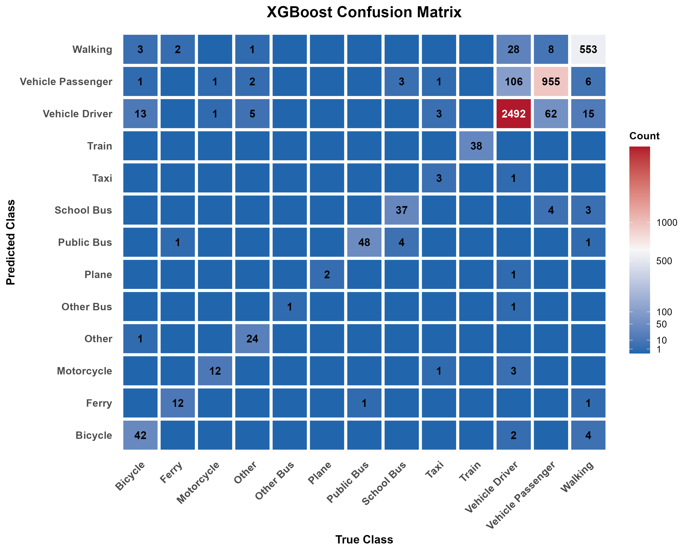

```{css, echo=FALSE}
.justify {
  text-align: justify;
  text-justify: inter-word;
}
.fontsize {
  font-size: 12px;
}
```

```{r setup, include=FALSE}
knitr::opts_chunk$set(
  echo = TRUE,
  message = FALSE,   
  warning = FALSE)
```

```{r all_codes}

#---2. Data Description---
path <- "./final_decoded.csv"  
df <- read.csv(path,
               header = TRUE,
               fileEncoding = "UTF-8",
               na.strings = c("", "NA"))
#head(df)

library(dplyr)
library(tibble)
library(knitr)

n_rows <- nrow(df)
n_cols <- ncol(df)

is_num <- sapply(df, is.numeric)
n_numeric    <- sum(is_num, na.rm = TRUE)
n_non_numeric <- n_cols - n_numeric

summary_tbl <- tibble::tibble(
  Indicator = c(" rows", "columns", "Numeric variable", "Non-numeric variable"),
  number = c(n_rows, n_cols, n_numeric, n_non_numeric)
)

library(dplyr)
library(purrr)
library(tibble)
library(knitr)
num_cols<- names(df)[sapply(df, is.numeric)]
num_profile <- purrr::map_dfr(num_cols, function(cn) {
  s <- df[[cn]]; n <- length(s)
  non_na <- sum(!is.na(s)); miss <- sum(is.na(s))
  miss_rate <- miss / n * 100
  uniq <- dplyr::n_distinct(s, na.rm = TRUE)
  zero_cnt  <- sum(s == 0, na.rm = TRUE)
  zero_rate <- zero_cnt / n * 100
  qs <- quantile(s, probs = c(0, 0.25, 0.5, 0.75, 1),
                 na.rm = TRUE, names = FALSE, type = 7)

  tibble::tibble(
    `Indicator`          = cn,
    `non-missing`        = non_na,
    `Missing values`     = miss,
    `Missing Rate%`      = round(miss_rate, 2),
    `Unique value count` = uniq,
    `zero value`         = zero_cnt,
    `Zero-rate%`         = round(zero_rate, 2),
    `mean`               = mean(s, na.rm = TRUE),
    `Standard deviation` = sd(s, na.rm = TRUE),
    `min` = qs[1], `P25` = qs[2], `median` = qs[3], `P75` = qs[4], `max` = qs[5]
  )
})
num_profile <- num_profile %>%
  mutate(
    across(
      all_of(c("mean", "Standard deviation", "min", "P25", "median", "P75", "max")),
      ~ round(.x, 4)
    )
  ) %>%
  arrange(desc(`Missing Rate%`), `Indicator`)

num_profile_table <- kable(num_profile, align = "lrrrrrrrrrrrrr")


cat_cols <- names(df)[!sapply(df, is.numeric)]
topk <- 3
cat_profile <- map_dfr(cat_cols, function(cn) {
  s <- df[[cn]]
  n <- length(s)
  non_na <- sum(!is.na(s))
  miss   <- sum(is.na(s))
  miss_rate <- miss / n * 100
  uniq <- dplyr::n_distinct(s, na.rm = TRUE)
  
  vc <- sort(table(as.character(s[!is.na(s)]), useNA = "no"), decreasing = TRUE)
  k  <- min(topk, length(vc))
  top_vals  <- if (k > 0) names(vc)[seq_len(k)] else character(0)
  top_freqs <- if (k > 0) as.integer(vc[seq_len(k)]) else integer(0)
  
   if (length(top_vals) < topk)  top_vals  <- c(top_vals,  rep(NA_character_, topk - length(top_vals)))
  if (length(top_freqs) < topk) top_freqs <- c(top_freqs, rep(NA_integer_,  topk - length(top_freqs)))

  tibble(
    variable         = cn,
    non_missing      = non_na,
    missing          = miss,
    missing_rate_pct = round(miss_rate, 2),
    unique_count     = uniq,
    top1_value       = top_vals[1],
    top1_count       = top_freqs[1],
    top1_pct         = round(top_freqs[1] * 100 / n, 2),
    top2_value       = top_vals[2],
    top2_count       = top_freqs[2],
    top2_pct         = round(top_freqs[2] * 100 / n, 2),
    top3_value       = top_vals[3],
    top3_count       = top_freqs[3],
    top3_pct         = round(top_freqs[3] * 100 / n, 2)
  )
})

cat_profile <- cat_profile %>% arrange(desc(missing_rate_pct), variable)

cat_profile_table <- kable(cat_profile, align = "lrrrrlrrlrrlrr")

# set Parameters
threshold_mad      <- 7      # robust z threshold; 7 is conservative
min_non_missing    <- 30     # skip columns with too few non-missing values
show_only_ge1pct   <- TRUE   # report only columns with >= 1% outliers

num_cols <- names(df)[sapply(df, is.numeric)]
mad_raw <- function(x) mad(x, na.rm = TRUE, constant = 1)

#---outlier---
# Compute outlier rate per numeric column
outlier_rate_tbl <- map_dfr(num_cols, function(cn) {
  s <- df[[cn]]
  s <- s[!is.na(s)]
  n <- length(s)
  if (n < min_non_missing) {
    return(tibble(
      variable = cn, non_missing = n,
      outlier_count = NA_integer_, outlier_rate_pct = NA_real_,
      median = NA_real_, mad = NA_real_
    ))
  }
  med <- median(s, na.rm = TRUE)
  m   <- mad_raw(s)
  if (is.na(m) || m == 0) {
    return(tibble(
      variable = cn, non_missing = n,
      outlier_count = NA_integer_, outlier_rate_pct = NA_real_,
      median = med, mad = m
    ))
  }
  rz  <- abs(s - med) / m
  cnt <- sum(rz > threshold_mad, na.rm = TRUE)
  tibble(
    variable = cn,
    non_missing = n,
    outlier_count = cnt,
    outlier_rate_pct = round(cnt * 100 / n, 3),
    median = med,
    mad = m
  )
})

outlier_rate_tbl <- outlier_rate_tbl %>%
  arrange(desc(outlier_rate_pct), variable)

if (show_only_ge1pct) {
  outlier_rate_tbl <- outlier_rate_tbl %>%
    filter(!is.na(outlier_rate_pct), outlier_rate_pct >= 1)
}
result_outliers <- outlier_rate_tbl %>%
  select(variable, outlier_rate_pct, outlier_count, non_missing)

outliers_table <- kable(result_outliers, align = "lrrr",
      col.names = c("variable", "outlier_rate_pct", "outlier_count", "non_missing"))

#---High Cardinality---
# Choose categorical columns
cat_cols <- names(df)[sapply(df, function(x) is.character(x) || is.factor(x))]

# Compute unique counts and rates
n <- nrow(df)
hi_card_tbl <- lapply(cat_cols, function(cn) {
  s <- df[[cn]]
  u <- dplyr::n_distinct(s, na.rm = TRUE)
  tibble(
    variable = cn,
    n_unique = u,
    unique_rate_pct = round(u * 100 / max(1, n), 2)
  )
}) |> bind_rows()

# Filter by high-cardinality rule and sort
hi_card_tbl <- hi_card_tbl |>
  filter(n_unique > 100 | unique_rate_pct > 50) |>
  arrange(desc(n_unique), desc(unique_rate_pct), variable)

# Print as a table
hi_card_table <- kable(hi_card_tbl, align = "lrr",
      col.names = c("variable", "n_unique", "unique_rate_pct"))

#---Zero flation---
# Parameters
threshold_pct <- 90  # zero-rate threshold (percentage)

# Select numeric columns
num_cols <- names(df)[sapply(df, is.numeric)]

# Compute zero rate per numeric column
zero_inflated_tbl <- map_dfr(num_cols, function(cn) {
  s <- df[[cn]]
  n_non_missing <- sum(!is.na(s))
  if (n_non_missing == 0) {
    return(tibble(variable = cn, zero_rate_pct = NA_real_))
  }
  zeros <- sum(s == 0, na.rm = TRUE)
  tibble(
    variable = cn,
    zero_rate_pct = round(100 * zeros / n_non_missing, 2)
  )
}) %>%
  filter(!is.na(zero_rate_pct), zero_rate_pct >= threshold_pct) %>%
  arrange(desc(zero_rate_pct), variable)

# Print as a table
zero_inflated_table <- kable(zero_inflated_tbl, align = "lr",
      col.names = c("variable", "zero_rate_pct"))

#---Multicolinearlity---
# Parameters
corr_threshold <- 0.95   # |r| threshold

# Select numeric columns
num_cols <- names(df)[sapply(df, is.numeric)]

# Compute correlation matrix
if (length(num_cols) < 2) {
  result_corr <- tibble(
    var1 = character(0), var2 = character(0),
    r = numeric(0), abs_r = numeric(0)
  )
} else {
  cor_mat <- suppressWarnings(
    cor(df[, num_cols, drop = FALSE], use = "pairwise.complete.obs", method = "pearson")
  )
  # Extract upper triangle pairs
  idx <- which(upper.tri(cor_mat), arr.ind = TRUE)
  result_corr <- tibble(
    var1  = rownames(cor_mat)[idx[, 1]],
    var2  = colnames(cor_mat)[idx[, 2]],
    r     = cor_mat[idx],
    abs_r = abs(cor_mat[idx])
  ) %>%
    filter(!is.na(r), abs_r >= corr_threshold) %>%
    arrange(desc(abs_r), var1, var2)
}

# Print as a table
corr_table <- kable(result_corr, align = "llrr",
      col.names = c("var1", "var2", "r", "abs_r"))

#---3.Data Cleaning---
library(readr); library(dplyr); library(tidyr); library(stringr)
library(janitor); library(ggplot2); library(scales); library(purrr)

in_csv  <- "final_decoded.csv"
out_csv <- "final_decoded_clean.csv"

# Use a different variable name to avoid conflict with base R's df function
df <- readr::read_csv(in_csv, show_col_types = FALSE) %>%
  mutate(across(everything(), ~ ifelse(is.character(.x) &
      stringr::str_trim(.x) %in% c("", "Missing", "missing", "N/A", "NA", "n/a"), NA, .x)))

#message(sprintf("Initial dataset: %d rows × %d columns", nrow(df), ncol(df)))

#--3.1 Missing Value---
# Check and clean target variable
invisible({
  if ("STOP_MAINMODE" %in% names(df)) {
    target_missing <- sum(is.na(df$STOP_MAINMODE) | df$STOP_MAINMODE == "")
    df <- df %>% filter(!is.na(STOP_MAINMODE) & STOP_MAINMODE != "")

    message(sprintf("Removed %d rows (%.1f%%) with missing STOP_MAINMODE",
                    target_missing, target_missing/nrow(df)*100))
    message(sprintf("Remaining: %d samples with %d travel modes",
                    nrow(df), length(unique(df$STOP_MAINMODE))))
  } else {
    warning("STOP_MAINMODE not found in dataset!")
  }
})

#---Drop Missing value---
# Ensure df is available and is a data frame
if (!exists("df") || !is.data.frame(df)) {
  stop("df is not properly loaded as a data frame")
}

miss_tbl <- df %>%
  summarize(across(everything(), ~ mean(is.na(.)))) %>%
  pivot_longer(everything(), names_to = "column", values_to = "missing_rate") %>%
  arrange(desc(missing_rate))

missing_table <- ggplot(head(miss_tbl, 20),
       aes(x = reorder(column, missing_rate), y = missing_rate)) +
  geom_col() +
  coord_flip() +
  scale_y_continuous(labels = percent) +
  labs(title = "Top 20 Variables by Missingness", x = NULL, y = "Missing rate")

high_miss_cols <- miss_tbl %>% filter(missing_rate >= 0.5) %>% pull(column)
if (length(high_miss_cols)) {
  df <- df %>% select(-all_of(high_miss_cols))
  message(sprintf("Dropped %d columns with >95%% missing", length(high_miss_cols)))
}

#--Vehicle and Trip imputation---
# Vehicle variables - critical for mode choice prediction
# Include ALL vehicle-related variables, not just those prefixed with "veh_"
veh_related_patterns <- c("^veh_", "^STOP_VEH", "_VEH")
veh_cols <- names(df)[Reduce(`|`, lapply(veh_related_patterns, 
                             function(p) grepl(p, names(df), ignore.case = TRUE)))]
veh_cat <- veh_cols[sapply(df[veh_cols], is.character)]
veh_num <- veh_cols[sapply(df[veh_cols], is.numeric)]

# Categorical: NA -> "No Vehicle" (meaningful for non-motorized trips)
if (length(veh_cat)) {
  df <- df %>% mutate(across(all_of(veh_cat), ~ ifelse(is.na(.x), "No Vehicle", .x)))
}

# Numeric: use 0 for no vehicle (more logical than median)
for (cn in veh_num) {
  if (grepl("VEHWALKTIME", cn)) {
    # Walk time: use median of positive values
    walk_times <- df[[cn]][!is.na(df[[cn]]) & df[[cn]] > 0]
    median_walk <- if(length(walk_times) > 0) median(walk_times) else 0
    df[[cn]] <- ifelse(is.na(df[[cn]]), median_walk, df[[cn]])
  } else {
    # Other vehicle metrics: 0 indicates no vehicle
    df[[cn]] <- ifelse(is.na(df[[cn]]), 0, df[[cn]])
  }
  # Add imputation flag for model transparency
  df[[paste0(cn, "_imputed")]] <- as.integer(is.na(df[[cn]]))
}

# Trip/Stop timing variables - important for temporal patterns
time_vars <- c("TRIP_DURATION", "TRIP_DEPHR", "TRIP_DEPTIME",
               "STOP_DURATION", "STOP_DEPHR", "STOP_DEPTIME")

for (var in time_vars) {
  if (var %in% names(df) && sum(is.na(df[[var]])) > 0) {
    if (grepl("DURATION", var)) {
      # Try to calculate from other time fields first
      if (grepl("TRIP", var) && all(c("TRIP_TRAVTIME", "TRIP_WAITTIME") %in% names(df))) {
        calc_duration <- df$TRIP_TRAVTIME + df$TRIP_WAITTIME
        df[[var]] <- ifelse(is.na(df[[var]]) & !is.na(calc_duration), calc_duration, df[[var]])
      }
      # Use median for remaining NAs
      if (sum(!is.na(df[[var]])) > 0) {
        df[[var]] <- ifelse(is.na(df[[var]]), median(df[[var]], na.rm = TRUE), df[[var]])
      }
      
    } else if (grepl("DEPHR|DEPTIME", var)) {
      # Try reconstruction from arrival - duration
      arr_var <- gsub("DEP", "ARR", var)
      dur_var <- gsub("DEPHR|DEPTIME", "DURATION", var)
      if (arr_var %in% names(df) && dur_var %in% names(df)) {
        calc_dep <- if(grepl("HR", var)) df[[arr_var]] - df[[dur_var]]/60 else df[[arr_var]] - df[[dur_var]]
        df[[var]] <- ifelse(is.na(df[[var]]) & !is.na(calc_dep), calc_dep, df[[var]])
      }
      # Use mode (peak hour patterns) for remaining NAs
      if (sum(!is.na(df[[var]])) > 0) {
        mode_val <- as.numeric(names(sort(table(round(df[[var]])), decreasing = TRUE)[1]))
        df[[var]] <- ifelse(is.na(df[[var]]), mode_val, df[[var]])
      }
    }
    # Add imputation flag
    #df[[paste0(var, "_imputed")]] <- as.integer(is.na(df[[var]]))
  }
}

# Other categorical Trip/Stop variables: mode imputation
trip_stop_cat <- grep("^(TRIP_|STOP_)", names(df), value = TRUE)
trip_stop_cat <- trip_stop_cat[sapply(df[trip_stop_cat], is.character)]
trip_stop_cat <- setdiff(trip_stop_cat, "STOP_MAINMODE")  # Exclude target

for (col in trip_stop_cat) {
  if (sum(is.na(df[[col]])) > 0) {
    non_na <- df[[col]][!is.na(df[[col]])]
    if (length(non_na) > 0) {
      mode_val <- names(sort(table(non_na), decreasing = TRUE))[1]
      df[[col]] <- ifelse(is.na(df[[col]]), mode_val, df[[col]])
    }
  }
}

#message(sprintf("Imputed vehicle and timing variables; created %d imputation flags", 
                #sum(grepl("_imputed$", names(df)))))

#{r drop-rows-near-complete, message=FALSE, warning=FALSE}
miss_updated <- colMeans(is.na(df))
near_complete <- names(miss_updated)[miss_updated > 0 & miss_updated <= 0.001]
if (length(near_complete)) {
  n_before <- nrow(df)
  df <- df %>% drop_na(all_of(near_complete))
  message(sprintf("Dropped %d rows with missing values in near-complete columns", n_before - nrow(df)))
}

#{r check-remaining-missing, message=FALSE, warning=FALSE}
remaining_missing <- colSums(is.na(df))
remaining_missing <- remaining_missing[remaining_missing > 0]
if (length(remaining_missing) > 0) {
  missing_summary <- data.frame(
    variable = names(remaining_missing),
    missing_count = remaining_missing,
    missing_pct = round(remaining_missing/nrow(df) * 100, 2)
  )
  #cat("Variables with remaining missing values:\n")
  #print(head(missing_summary[order(missing_summary$missing_pct, decreasing = TRUE), ], 10))
}

# 3.2 {r negative&special-value-check, message=FALSE, warning=FALSE}
numeric_cols <- names(df)[sapply(df, is.numeric)]
no_negative_patterns <- c("AGE", "YEAR", "COUNT", "_NUM$", "^ID", "_ID$", "_NO$",
                          "DIST", "DURATION", "TIME$", "TRAVTIME", "WEIGHT", "WGT")

for (col in numeric_cols) {
  if (any(df[[col]] < 0, na.rm = TRUE)) {
    should_be_positive <- any(sapply(no_negative_patterns, 
                                     function(p) grepl(p, col, ignore.case = TRUE)))
    if (should_be_positive) {
      neg_vals <- unique(df[[col]][df[[col]] < 0])
      if (all(neg_vals %in% c(-1, -99, -999))) {
        df[[col]] <- ifelse(df[[col]] %in% c(-1, -99, -999), NA, df[[col]])
        message(sprintf("%s: Converted special codes to NA", col))
      }
    }
  }
}

# Convert ambiguous numeric codes in character columns to NA
char_cols <- names(df)[sapply(df, is.character)]
for (col in char_cols) {
  # Convert codes that appear to be special values to NA
  df[[col]] <- ifelse(df[[col]] %in% c("998", "999", "997", "-1", "-99", "-999"), 
                      NA_character_, 
                      df[[col]])
}

# 3.3 {r mixed-type-sanitise, message=FALSE, warning=FALSE}
parse_numeric_safe <- function(x){
  if (!is.character(x)) return(x)
  suppressWarnings(readr::parse_number(x))
}

# Vehicle numeric columns
veh_cols <- names(df)[grepl("^veh_", names(df), ignore.case = TRUE)]
num_patterns <- c("year","age","engine","seats")
veh_num_like <- veh_cols[Reduce(`|`, lapply(num_patterns, 
                                function(p) grepl(p, veh_cols, ignore.case = TRUE)))]
if (length(veh_num_like)) {
  df <- df %>% mutate(across(all_of(intersect(veh_num_like, names(df))), parse_numeric_safe))
}

# Other clearly numeric columns
for (pattern in c("TIME", "DIST", "WEIGHT", "WGT", "SPEED")) {
  cols <- grep(pattern, names(df), value = TRUE, ignore.case = TRUE)
  cols <- cols[!grepl("ID|_NO$|^VEH", cols)]
  for (col in cols) {
    if (is.character(df[[col]])) df[[col]] <- parse_numeric_safe(df[[col]])
  }
}

# 3.4 {r drop-duplicates, message=FALSE, warning=FALSE}
# STOPID is the unique row identifier (one stop = one row)
# PERSID and TRIPID are retained for grouping/hierarchical analysis

# Remove only artificial index columns (if any)
idx_cols <- grep("(^row_|^index$|unnamed)", names(df), ignore.case = TRUE, value = TRUE)
if (length(idx_cols)) {
  df <- df %>% select(-all_of(idx_cols))
  message(sprintf("Removed %d artificial index columns", length(idx_cols)))
}

# Verify STOPID uniqueness
if ("STOPID" %in% names(df)) {
  n_unique_stops <- length(unique(df$STOPID))
  if (n_unique_stops < nrow(df)) {
    warning(sprintf("STOPID is not unique! %d unique values for %d rows", 
                    n_unique_stops, nrow(df)))
    # Find duplicate STOPIDs
    dup_stops <- df %>% 
      group_by(STOPID) %>% 
      filter(n() > 1) %>%
      arrange(STOPID)
    message(sprintf("Found %d rows with duplicate STOPID", nrow(dup_stops)))
  } else {
    message("STOPID is unique (good)")
  }
}

# Check for duplicate rows EXCLUDING STOPID
# This finds rows that are identical except for their STOPID
df_check <- df %>% select(-STOPID)
n_complete_dup <- sum(duplicated(df_check))
if (n_complete_dup > 0) {
  message(sprintf("Found %d rows that are identical except for STOPID", n_complete_dup))
  # These might be data entry errors or legitimate similar trips
}

# Remove exact duplicate rows (including STOPID)
before_dedup <- nrow(df)
df <- df %>% distinct()
after_dedup <- nrow(df)
if (before_dedup > after_dedup) {
  message(sprintf("Removed %d exact duplicate rows", before_dedup - after_dedup))
}


# 3.5 {r outliers, message=FALSE, warning=FALSE}
cap_iqr <- function(x){
  if (!is.numeric(x)) return(x)
  q <- quantile(x, c(0.25, 0.75), na.rm = TRUE)
  iqr <- q[2] - q[1]
  if (!is.finite(iqr) || iqr == 0) return(x)
  x[x < q[1] - 1.5*iqr] <- q[1] - 1.5*iqr
  x[x > q[2] + 1.5*iqr] <- q[2] + 1.5*iqr
  x
}

num_cols <- names(df)[sapply(df, is.numeric)]
skip_cols <- grep("(dist|time|duration|fare|cost|amount)", num_cols, ignore.case = TRUE, value = TRUE)
cap_cols <- setdiff(num_cols, skip_cols)
df <- df %>% mutate(across(all_of(cap_cols), cap_iqr))

# {r save, message=FALSE, warning=FALSE}
readr::write_csv(df, out_csv)
#cat(sprintf("Final dataset: %d rows × %d columns\n", nrow(df), ncol(df))) 

# 4.1 {r}

df <- read.csv("./final_decoded_clean_v3.csv")

library(readxl)
library(dplyr)
library(purrr)
library(ggplot2)
library(stringr)
library(tibble)
library(scales)
library(dendextend)

# find target
nm_lower <- tolower(names(df))
y_col <- names(df)[nm_lower == "stop_mainmode"]
if (length(y_col) == 0) {

  cand <- names(df)[str_detect(nm_lower, "stop") &
                    str_detect(nm_lower, "main") &
                    str_detect(nm_lower, "mode")]

  y_col <- cand[1]
}
df[[y_col]] <- as.factor(df[[y_col]])

# Metric function: η²
eta_sq_num_factor <- function(x, y) {
  ok <- !is.na(x) & !is.na(y)
  x <- x[ok]; y <- y[ok]
  if (length(x) < 3 || nlevels(y) < 2) return(NA_real_)
  mu <- mean(x)

  ss_total <- sum((x - mu)^2)
  if (ss_total <= 0) return(NA_real_)

  ss_between <- sum(sapply(levels(y), function(lv) {
    xi <- x[y == lv]
    if (length(xi) == 0) return(0)
    length(xi) * (mean(xi) - mu)^2
  }))
  ss_between / ss_total
}

# Metric function: Cramér's V
cramers_v_corrected <- function(x, y) {
  
  tbl <- table(x, y)
  if (nrow(tbl) < 2 || ncol(tbl) < 2) return(NA_real_)
  chi <- suppressWarnings(chisq.test(tbl, correct = FALSE))
  n <- sum(tbl)
  if (n == 0) return(NA_real_)
  phi2 <- as.numeric(chi$statistic) / n
  r <- nrow(tbl); c <- ncol(tbl)
  
  # Correct bias
  if (n > 1) {
    phi2corr <- max(0, phi2 - ((r - 1) * (c - 1)) / (n - 1))
    rcorr <- r - ((r - 1)^2) / (n - 1)
    ccorr <- c - ((c - 1)^2) / (n - 1)
    denom <- min(rcorr - 1, ccorr - 1)
  } else {
    phi2corr <- phi2; denom <- min(r - 1, c - 1)
  }
  if (denom <= 0) return(NA_real_)
  sqrt(phi2corr / denom)
}

# Calculating correlation
y <- df[[y_col]]
feat_names <- setdiff(names(df), y_col)

#  η²
scored_eta <- map_dfr(feat_names, function(f) {
  x <- df[[f]]
  if (is.numeric(x)) {
    val <- eta_sq_num_factor(x, y)
    tibble(feature = f, association = val, metric = "eta_sq (num~factor)")
  }
})

# Cramér's V
scored_cramers <- map_dfr(feat_names, function(f) {
  x <- df[[f]]
  if (!is.numeric(x)) {
    val <- cramers_v_corrected(as.factor(x), y)
    tibble(feature = f, association = val, metric = "cramers_v (cat~cat)")
  }
})

# Top 20 most relevant features
topk_eta <- scored_eta |>
  filter(!is.na(association) & is.finite(association)) |>
  arrange(desc(association)) |>
  slice_head(n = 20)

topk_cramers <- scored_cramers |>
  filter(!is.na(association) & is.finite(association)) |>
  arrange(desc(association)) |>
  slice_head(n = 20)

# diagram η²
eta_plot <- ggplot(topk_eta, aes(x = reorder(feature, association), y = association)) +
  geom_col() +
  coord_flip() +
  labs(title = "Top features related to stop_mainmode (η²)", 
       x = "Feature", y = "Association (η²)") +
  theme_minimal(base_size = 12)

# diagram Cramér's V
cramers_plot <- ggplot(topk_cramers, aes(x = reorder(feature, association), y = association)) +
  geom_col() +
  coord_flip() +
  labs(title = "Top features related to stop_mainmode (Cramér's V)", 
       x = "Feature", y = "Association (Cramér's V)") +
  theme_minimal(base_size = 12)

# 4.2
tau  <- 0.80      
cut_h <- 1 - tau                      

X   <- df %>% select(where(is.numeric))   

const_cols <- names(X)[sapply(X, function(x) var(x, na.rm = TRUE) == 0 | all(is.na(x)))]
if (length(const_cols) > 0) X <- X %>% select(-all_of(const_cols))

X_imp <- X %>% mutate(across(everything(), ~ ifelse(is.na(.x), mean(.x, na.rm = TRUE), .x)))

corr <- cor(X_imp, use = "pairwise.complete.obs")
corr[!is.finite(corr)] <- 0
dist_mat <- 1 - abs(corr)             
keep_thresh <- 0.20

diag(corr) <- 0
max_abs_r <- apply(abs(corr), 2, function(v) max(v, na.rm = TRUE))
keep_idx   <- which(max_abs_r >= keep_thresh)

corr  <- corr[keep_idx, keep_idx, drop = FALSE]
X_imp <- X_imp[, keep_idx, drop = FALSE]
dist_mat <- 1 - abs(corr)
d        <- as.dist(dist_mat)
hc       <- hclust(d, method = "average")

library(dendextend)
par(mar = c(12, 4, 2, 1))  
dend <- as.dendrogram(hc) |>
  set("labels_cex", 0.60) |>      
  set("branches_lwd", 1.2)        

dend_col <- color_branches(dend, h = cut_h)

plot_dendrogram <- function() {
  plot(dend_col,
       ylab = "Distance = 1 - |corr|",
       main = sprintf("Colored branches by |r| cutoff = %.2f", tau))
  abline(h = cut_h, lty = 2, col = "red")
}

# 4.3
y_name <- names(df)[tolower(names(df)) == "stop_mainmode"]
y <- factor(df[[y_name]])

thr_pct <- 0.02   

dist_tbl <- as.data.frame(table(y)) |>
  rename(class = y, n = Freq) |>
  mutate(p = n/sum(n)) |>
  arrange(desc(n)) |>
  mutate(cum_p = cumsum(p),
         rare  = (p < thr_pct))

# Diagram1: Category distribution
dist_table <- ggplot(dist_tbl, aes(x = reorder(class, -n), y = n, fill = rare)) +
  geom_col() +
  geom_text(aes(label = percent(p, accuracy = 0.1)),
            vjust = -0.2, size = 3) +
  scale_fill_manual(values = c("FALSE"="grey","TRUE"="red"),
                    name = sprintf("Rare category: (p<%s)", percent(thr_pct))) +
  labs(title = "Category distribution of STOP_MAINMODE", x = "Category", y = "Number of category") +
  theme_minimal(base_size = 13) +
  theme(axis.text.x = element_text(angle = 30, hjust = 1),
        legend.position = "top")

#```{r setup, include=FALSE}
knitr::opts_chunk$set(echo = TRUE, warning = FALSE, message = FALSE)

# ==============================================================================
# FILE PATHS - MODIFY THESE IF NEEDED
# ==============================================================================
INPUT_FILE <- "final_decoded_clean.csv"      # Week 7 baseline dataset
OUTPUT_FILE <- "final_cleaned_policy_focused.csv"  # Policy-focused output

# ```{r load-data}
# Load required libraries
library(dplyr)
library(tidyr)
library(knitr)

# Load Week 7 baseline dataset
# cat("Loading Week 7 dataset...\n")
# cat(sprintf("Input file: %s\n", INPUT_FILE))
df <- read.csv(INPUT_FILE,
               stringsAsFactors = FALSE,
               na.strings = c("", "NA", "N/A", "NULL"))

# Show dataset dimensions
# cat(sprintf("✓ Loaded: %d rows × %d columns\n", nrow(df), ncol(df)))

# Preview first few rows
# head(df, 3)


# ```{r check-target}
# Verify target variable exists
target_col <- "STOP_MAINMODE"

if (!(target_col %in% names(df))) {
  stop("❌ Target variable STOP_MAINMODE not found!")
}
# Target exists, proceed silently


# ```{r vehicle-proxies}
# A. Trip-Specific Vehicle Proxies (DATA LEAKAGE)
# Note: Week 7 data has both original and _imputed versions - remove ALL
vehicle_proxies <- c(
  # Vehicle occupancy/identification (only for vehicle trips)
  "STOP_VEHOCCUP", "STOP_VEHOCCUP_imputed",
  "STOP_VEHONORANGEFORM", "STOP_VEHONORANGEFORM_imputed",
  "STOP_VEHNUM", "STOP_VEHNUM_imputed",
  "STOP_VEHPARKED",
  "STOP_VEHWALKTIME", "STOP_VEHWALKTIME_imputed",

  # Vehicle characteristics (only for vehicle users)
  "VEH_VEHTYPE",
  "VEH_VEHNO", "VEH_VEHNO_imputed",      # Vehicle number
  "VEH_VEHYEAR", "VEH_VEHYEAR_imputed",
  "VEH_VEHAGE", "VEH_VEHAGE_imputed",

  # Fuel type (only for vehicle users)
  "VEH_PETROL",
  "VEH_DIESEL",
  "VEH_GAS",
  "VEH_ELECTRIC",
  "VEH_HYBRID",

  # Vehicle economics (only for vehicle users)
  "VEH_RUNNINGCOST",
  "VEH_HHWGT14", "VEH_HHWGT14_imputed",
  "VEH_HHID"                              # Vehicle household ID
)

# cat("Variables to remove (Category A - Vehicle Proxies):\n")
# cat(sprintf("Total: %d variables (including _imputed versions)\n\n", length(vehicle_proxies)))
# found_count <- 0
# for (i in seq_along(vehicle_proxies)) {
#   if (vehicle_proxies[i] %in% names(df)) {
#     # cat(sprintf("  %2d. ✓ %s\n", i, vehicle_proxies[i]))
#     found_count <- found_count + 1
#   } else {
#     # cat(sprintf("  %2d. ⚠ %s (not in dataset)\n", i, vehicle_proxies[i]))
#   }
# }
# cat(sprintf("\nFound %d/%d variables in dataset\n", found_count, length(vehicle_proxies)))


# ```{r keep-household}
household_availability <- c(
  "HH_CARS",        # Number of cars household owns
  "HH_FOURWDS",     # Number of 4WDs
  "HH_UTES",        # Number of utes
  "HH_VANS",        # Number of vans
  "HH_TRUCKS",      # Number of trucks
  "HH_OTHERVEHS",   # Other vehicles
  "HH_TOTALVEHS"    # Total vehicles
)

# cat("\n✅ Household availability variables (KEPT):\n")
# for (var in household_availability) {
#   if (var %in% names(df)) {
#     # cat(sprintf("  • %s\n", var))
#   }
# }

# cat("\n📊 Key distinction:\n")
# cat("  • VEH_VEHTYPE (REMOVED) = Person USED a vehicle this trip → 100% proxy\n")
# cat("  • HH_CARS (KEPT) = Household OWNS cars → Enables choice, doesn't dictate it\n")


# ```{r low-value-vars}
# Check actual distribution
# cat("Distribution of PERS_REASONCODE:\n")
# if ("PERS_REASONCODE" %in% names(df)) {
#   reasoncode_table <- table(df$PERS_REASONCODE)
#   print(reasoncode_table)
#   # cat(sprintf("\nPercentage 'N/A': %.1f%%\n",
#               # 100 * reasoncode_table["N/A (some stops were made)"] / sum(reasoncode_table)))
# }

# cat("\nDistribution of PERS_MRTDOW:\n")
# if ("PERS_MRTDOW" %in% names(df)) {
#   mrtdow_table <- table(df$PERS_MRTDOW)
#   print(mrtdow_table)
#   # cat(sprintf("\nPercentage 'N/A': %.1f%%\n",
#               # 100 * max(mrtdow_table) / sum(mrtdow_table)))
# }

# Create binary missingness indicators
# cat("\n✓ Creating binary missingness indicators...\n")

if ("PERS_ADDITIONALTRAVEL" %in% names(df)) {
  df$PERS_ADDITIONALTRAVEL_missing <- as.integer(
    df$PERS_ADDITIONALTRAVEL == "N/A (some stops were made)" | is.na(df$PERS_ADDITIONALTRAVEL)
  )
  # cat("  • PERS_ADDITIONALTRAVEL_missing created\n")
}

if ("PERS_MRTDOW" %in% names(df)) {
  df$PERS_MRTDOW_missing <- as.integer(
    df$PERS_MRTDOW == "N/A (some stops were made)" | is.na(df$PERS_MRTDOW)
  )
  # cat("  • PERS_MRTDOW_missing created\n")
}

# Variables to remove
# Note: PERS_ADDITIONALTRAVEL is kept, only _missing indicator is added
# PERS_REASONCODE and PERS_MRTDOW are removed entirely
low_value_vars <- c(
  "PERS_REASONCODE",   # 94% same value → removed entirely
  "PERS_MRTDOW"        # 94% same value → removed, _missing indicator added
)

# cat("\nVariables to remove (Category B):\n")
# cat("  • PERS_REASONCODE (94% 'N/A' - removed entirely)\n")
# cat("  • PERS_MRTDOW (94% 'N/A' - removed, but _missing indicator added)\n")
# cat("\nNote: PERS_ADDITIONALTRAVEL is kept, and _missing indicator is added\n")


# ```{r administrative-vars}
# C. Administrative/Redundant Variables (54 variables)
administrative_vars <- c(
  # Survey administration metadata (6 vars)
  "PERS_WHOFILLED",         # Who filled the survey - not predictive
  "PERS_PROXY",             # Proxy respondent - not predictive
  "PERS_FILLDOW",           # Day survey filled - not predictive
  "PERS_FILLAG",            # Age of survey - not predictive
  "PERS_FURTHERRESEARCH",   # Consent for research - not predictive
  "PERS_NEWSTOP",           # Administrative flag

  # Cycling-specific (8 vars, too granular)
  "PERS_CYCLEDWORK",        # Cycled to work in past week
  "PERS_CYCLEDSHOPPING",    # Cycled shopping in past week
  "PERS_CYCLEDSCHOOL",      # Cycled to school in past week
  "PERS_CYCLEDEXERCISE",    # Cycled for exercise in past week
  "PERS_CYCLEDOTHER",       # Cycled other in past week
  "PERS_NOCYCLED",          # Did not cycle in past week
  "PERS_CYCLEDBIKEPARK",    # Access to bike parking - too specific
  "PERS_CYCLEDSHOWERS",     # Access to showers - too specific

  # Technology metadata (2 vars)
  "PERS_ISSMARTPHONE",      # Has smartphone - weak predictor
  "PERS_SMARTPHONEBRAND",   # Phone brand - not relevant

  # ID columns (5 vars - survey identifiers only)
  "STOPID",                 # Stop identifier
  "PERSID",                 # Person identifier
  "HHID",                   # Household identifier
  "TRIPID",                 # Trip identifier
  "VEHID",                  # Vehicle identifier

  # Weight columns (5 vars - redundant with HH_HHWGT14)
  "PERS_PERSWGT14",         # Person weight (redundant)
  "STOP_STOPWGT14",         # Stop weight (redundant)
  "STOP_STOPBASEWEIGHT",    # Stop base weight (redundant)
  "TRIP_TRIPWGT14",         # Trip weight (redundant)
  "TRIP_TRIPBASEWEIGHT",    # Trip base weight (redundant)

  # Time columns (8 vars - raw timestamps not useful)
  "STOP_ARRTIME",           # Arrival time (STOP_DEPHR captures pattern)
  "STOP_DEPTIME",           # Departure time (STOP_DEPHR captures pattern)
  "STOP_STARTTIME",         # Start time (STOP_STARTHR captures pattern)
  "TRIP_ARRTIME",           # Trip arrival time (redundant)
  "TRIP_DEPTIME",           # Trip departure time (redundant)
  "TRIP_STARTIME",          # Trip start time (typo in original data)
  "TRIP_ARRHR",             # Trip arrival hour (redundant)
  "TRIP_STARTHR",           # Trip start hour (redundant)
  "STOP_ARRHR",             # Stop arrival hour (redundant)

  # Trip/Stop detail columns (8 vars - overly granular mode info)
  "STOP_FULLMODE",          # Full mode description (STOP_MAINMODE sufficient)
  "TRIP_LINKMODE",          # Linking mode between stops (too detailed)
  "TRIP_MODE1",             # First mode used (too detailed)
  "TRIP_TIMEMODE",          # Time spent in each mode (too detailed)
  "TRIP_ENDSTOP",           # End stop number (positional info, not predictive)
  "TRIP_STARTSTOP",         # Start stop number (positional info)
  "STOP_STOPNO",            # Stop number (just ordering)
  "TRIP_TRIPNO",            # Trip number (just ordering)

  # Trip structure metadata (2 vars)
  "TRIP_TRIPSTAGES",        # Internal trip structure - redundant
  "TRIP_TOTTRIPTIME",       # Total trip time (TRIP_TRAVTIME sufficient)

  # Household temporal metadata (3 vars)
  "HH_TRAVDATE",            # Specific date - IS_WEEKEND captures pattern
  "HH_TRAVMONTH",           # Month - not needed
  "HH_TRAVYEAR",            # Year - all 2014 survey

  # Redundant work variables (3 vars)
  "PERS_FULLTIMEWORK",      # Full-time work (PERS_MAINACT captures this)
  "PERS_PARTTIMEWORK",      # Part-time work (PERS_MAINACT captures this)
  "PERS_ANYSTOPS",          # Any stops made (PERS_NUMSTOPS captures this)

  # Other redundant variables (3 vars)
  "STOP_MORESTOPS",         # More stops made (PERS_NUMSTOPS captures this)
  "TRIP_TIME1"              # Duplicate of TRIP_TRAVTIME
)

# cat("Variables to remove (Category C):\n")
# cat("\nSurvey administration (6 vars):\n")
# cat("  • PERS_WHOFILLED, PERS_PROXY, PERS_FILLDOW, PERS_FILLAG\n")
# cat("  • PERS_FURTHERRESEARCH, PERS_NEWSTOP\n")

# cat("\nCycling-specific (8 vars, too granular):\n")
# cat("  • PERS_CYCLEDWORK, PERS_CYCLEDSHOPPING, PERS_CYCLEDSCHOOL\n")
# cat("  • PERS_CYCLEDEXERCISE, PERS_CYCLEDOTHER, PERS_NOCYCLED\n")
# cat("  • PERS_CYCLEDBIKEPARK, PERS_CYCLEDSHOWERS\n")

# cat("\nTechnology metadata (2 vars):\n")
# cat("  • PERS_ISSMARTPHONE, PERS_SMARTPHONEBRAND\n")

# cat("\nID columns (5 vars):\n")
# cat("  • STOPID, PERSID, HHID, TRIPID, VEHID\n")

# cat("\nWeight columns (5 vars, redundant with HH_HHWGT14):\n")
# cat("  • PERS_PERSWGT14, STOP_STOPWGT14, STOP_STOPBASEWEIGHT\n")
# cat("  • TRIP_TRIPWGT14, TRIP_TRIPBASEWEIGHT\n")

# cat("\nTime columns (9 vars, raw timestamps):\n")
# cat("  • STOP_ARRTIME, STOP_DEPTIME, STOP_STARTTIME, STOP_ARRHR\n")
# cat("  • TRIP_ARRTIME, TRIP_DEPTIME, TRIP_STARTIME, TRIP_ARRHR, TRIP_STARTHR\n")

# cat("\nTrip/Stop details (8 vars, overly granular):\n")
# cat("  • STOP_FULLMODE, TRIP_LINKMODE, TRIP_MODE1, TRIP_TIMEMODE\n")
# cat("  • TRIP_ENDSTOP, TRIP_STARTSTOP, STOP_STOPNO, TRIP_TRIPNO\n")

# cat("\nTrip structure (2 vars):\n")
# cat("  • TRIP_TRIPSTAGES, TRIP_TOTTRIPTIME\n")

# cat("\nHousehold temporal (3 vars):\n")
# cat("  • HH_TRAVDATE, HH_TRAVMONTH, HH_TRAVYEAR\n")

# cat("\nRedundant variables (6 vars):\n")
# cat("  • PERS_FULLTIMEWORK, PERS_PARTTIMEWORK, PERS_ANYSTOPS\n")
# cat("  • STOP_MORESTOPS, TRIP_TIME1\n")

# Count how many actually exist in dataset
admin_found <- sum(administrative_vars %in% names(df))
# cat(sprintf("\n✓ Found %d/%d administrative variables in dataset\n",
            # admin_found, length(administrative_vars)))


# ```{r feature-engineering-early}
# cat("=== FEATURE ENGINEERING (BEFORE REMOVAL) ===\n\n")

# Vehicle availability features (per capita metrics - NOT trip-specific)
# cat("1. Creating vehicle availability features...\n")
df <- df %>%
  mutate(
    VEH_PER_PERSON = if ("HH_TOTALVEHS" %in% names(.) && "HH_HHSIZE" %in% names(.)) {
      ifelse(HH_HHSIZE > 0, HH_TOTALVEHS / HH_HHSIZE, 0)
    } else 0,

    VEH_PER_ADULT = if ("HH_CARS" %in% names(.) && "HH_HHSIZE" %in% names(.)) {
      ifelse(HH_HHSIZE > 0, HH_CARS / HH_HHSIZE, 0)
    } else 0
  )
# cat("   ✓ VEH_PER_PERSON (vehicles per household member)\n")
# cat("   ✓ VEH_PER_ADULT (cars per adult)\n\n")

# Trip characteristics (uses TRIP_TOTTRIPTIME which will be removed later)
# cat("2. Creating trip characteristic features...\n")
df <- df %>%
  mutate(
    TRIP_SPEED = if ("TRIP_NETWORK_DIST" %in% names(.) && "TRIP_TOTTRIPTIME" %in% names(.)) {
      ifelse(TRIP_TOTTRIPTIME > 0, TRIP_NETWORK_DIST / (TRIP_TOTTRIPTIME / 60), 0)
    } else 0
  )

# Cap unrealistic speeds at 99th percentile or 150 km/h
if ("TRIP_SPEED" %in% names(df)) {
  speed_cap <- min(quantile(df$TRIP_SPEED, 0.99, na.rm = TRUE), 150)
  n_capped <- sum(df$TRIP_SPEED > speed_cap, na.rm = TRUE)
  if (n_capped > 0) {
    df$TRIP_SPEED[df$TRIP_SPEED > speed_cap] <- speed_cap
    # cat(sprintf("   ✓ TRIP_SPEED (capped at %.1f km/h for %d values)\n", speed_cap, n_capped))
  } else {
    # cat("   ✓ TRIP_SPEED (average trip speed in km/h)\n")
  }
}
# cat("\n")

# Temporal features
# cat("3. Creating temporal features...\n")
df <- df %>%
  mutate(
    TIME_PERIOD = if ("STOP_STARTHR" %in% names(.)) {
      case_when(
        STOP_STARTHR >= 6 & STOP_STARTHR < 9 ~ "Morning_Peak",
        STOP_STARTHR >= 9 & STOP_STARTHR < 16 ~ "Midday",
        STOP_STARTHR >= 16 & STOP_STARTHR < 19 ~ "Evening_Peak",
        STOP_STARTHR >= 19 | STOP_STARTHR < 6 ~ "Off_Peak",
        TRUE ~ "Unknown"
      )
    } else "Unknown",

    IS_WEEKEND = if ("HH_TRAVDOW" %in% names(.)) {
      as.integer(HH_TRAVDOW %in% c("Saturday", "Sunday"))
    } else 0
  )
# cat("   ✓ TIME_PERIOD (Morning_Peak/Midday/Evening_Peak/Off_Peak)\n")
# cat("   ✓ IS_WEEKEND (binary indicator)\n\n")

# Distance categories
# cat("4. Creating distance categories...\n")
df <- df %>%
  mutate(
    DIST_CATEGORY = if ("TRIP_NETWORK_DIST" %in% names(.)) {
      case_when(
        TRIP_NETWORK_DIST < 2 ~ "Very_Short",
        TRIP_NETWORK_DIST < 5 ~ "Short",
        TRIP_NETWORK_DIST < 15 ~ "Medium",
        TRIP_NETWORK_DIST < 30 ~ "Long",
        TRUE ~ "Very_Long"
      )
    } else "Unknown"
  )
# cat("   ✓ DIST_CATEGORY (Very_Short/Short/Medium/Long/Very_Long)\n\n")

# Interaction features
# cat("5. Creating interaction features...\n")
if ("PERS_CARLICENCE" %in% names(df) && "HH_CARS" %in% names(df)) {
  df <- df %>%
    mutate(HAS_LICENSE_AND_CAR = as.integer(PERS_CARLICENCE == "Yes" & HH_CARS > 0))
  # cat("   ✓ HAS_LICENSE_AND_CAR (has license AND household has car)\n")
}

# Handle any Inf/NaN from calculations
df <- df %>%
  mutate(across(where(is.numeric), ~replace(., is.infinite(.) | is.nan(.), 0)))

# cat("\n=== FEATURE ENGINEERING COMPLETE ===\n")
# cat(sprintf("Dataset now has %d columns (before removal)\n", ncol(df)))


# ```{r remove-variables}
# Combine all variables to remove
vars_to_remove <- c(vehicle_proxies, low_value_vars, administrative_vars)

# Check which exist in current dataset
vars_found <- vars_to_remove[vars_to_remove %in% names(df)]
vars_not_found <- vars_to_remove[!vars_to_remove %in% names(df)]

# cat("=== VARIABLE REMOVAL SUMMARY ===\n\n")
# cat(sprintf("Total variables to remove: %d\n", length(vars_to_remove)))
# cat(sprintf("  • Found in dataset: %d\n", length(vars_found)))
# cat(sprintf("  • Not found (already removed): %d\n", length(vars_not_found)))

# if (length(vars_not_found) > 0) {
#   cat("\nVariables not found in dataset:\n")
#   for (var in vars_not_found) {
#     # cat(sprintf("  ⚠ %s\n", var))
#   }
# }

# Perform removal
# cat("\nPerforming removal...\n")
df_clean <- df %>%
  select(-any_of(vars_found))

# cat(sprintf("✓ Removed %d variables\n", length(vars_found)))
# cat(sprintf("✓ Dataset now has %d columns (was %d)\n",
            # ncol(df_clean), ncol(df)))


# ```{r save-output}
# Create output directory if needed
output_dir <- "./"
if (!dir.exists(output_dir)) {
  dir.create(output_dir, recursive = TRUE)
  # cat("✓ Created directory:", output_dir, "\n")
}

# Save policy-focused dataset
# cat(sprintf("\nOutput file: %s\n", OUTPUT_FILE))
write.csv(df_clean, OUTPUT_FILE, row.names = FALSE)

# cat(sprintf("\n✓ Saved policy-focused dataset to:\n"))
# cat(sprintf("   %s\n", OUTPUT_FILE))
# cat(sprintf("\n   Dimensions: %d rows × %d columns\n",
            # nrow(df_clean), ncol(df_clean)))


# ```{r All_Models, include=FALSE}

# ========================================
# GLOBAL CONFIGURATION
# ========================================
# Set to TRUE to force retraining all models (ignoring cached models)
# Set to FALSE to use cached models if available (fast HTML rendering)
FORCE_RETRAIN <- FALSE

# Auto-install missing packages
required_packages <- c("tidymodels", "ranger", "doParallel", "dplyr", "readr",
                       "rpart", "rpart.plot", "caret", "xgboost",
                       "ParBayesianOptimization", "foreach", "glmnet", "vip", "tidyr", "forcats", "stringr")
missing_packages <- required_packages[!required_packages %in% installed.packages()[,"Package"]]
if (length(missing_packages) > 0) {
  # cat("Installing missing packages:", paste(missing_packages, collapse = ", "), "\n")
  install.packages(missing_packages, dependencies = TRUE, repos = "https://cloud.r-project.org")
}

# cat("\n========================================\n")
# cat("MODEL CACHING CONFIGURATION\n")
# cat("========================================\n")
# cat(sprintf("FORCE_RETRAIN: %s\n", FORCE_RETRAIN))
invisible({
  if (FORCE_RETRAIN) {
    # cat("[INFO] All models will be retrained (cache ignored)\n")
  } else {
    # cat("[INFO] Cached models will be used if available\n")
    # cat("[INFO] Set FORCE_RETRAIN=TRUE to retrain all models\n")
  }
})
# cat("========================================\n\n")


# ```{r Random_Forest, message=FALSE, warning=FALSE}
suppressPackageStartupMessages({
  library(tidymodels)
  library(ranger)
  library(doParallel)
  library(dplyr)
  library(readr)
})

set.seed(5003)

t_all_start_rf <- Sys.time()

DATA_PATH <- "final_cleaned_policy_focused.csv"

# cat("\n=== Random Forest: Grid Search Optimization ===\n")

# ========================================
# SETUP (Always needed, before cache check)
# ========================================
# Log file setup
log_file_rf <- "results/logs/random_forest_optimization.log"
dir.create(dirname(log_file_rf), showWarnings = FALSE, recursive = TRUE)

# ========================================
# CACHE CHECK
# ========================================
cache_model_rf <- "results/random_forest/trained_model.rds"
cache_params_rf <- "results/random_forest/best_params.rds"
cache_grid_rf <- "results/random_forest/grid_results.rds"

if (!FORCE_RETRAIN && file.exists(cache_model_rf) && file.exists(cache_params_rf)) {
  # cat("[CACHE] Loading cached Random Forest model...\n")
  final_fit <- readRDS(cache_model_rf)
  best_params <- readRDS(cache_params_rf)
  if (file.exists(cache_grid_rf)) {
    grid_res <- readRDS(cache_grid_rf)
  }
  SKIP_TRAINING_RF <- TRUE
  # cat("[CACHE] Loaded successfully. Skipping training.\n\n")
} else {
  if (FORCE_RETRAIN) {
    # cat("[INFO] FORCE_RETRAIN=TRUE: Retraining model\n")
  } else {
    # cat("[INFO] No cache found. Running optimization\n")
  }
  # cat("[INFO] Grid search over hyperparameter combinations\n")
  # cat("[INFO] 5-fold CV per combination\n")
  SKIP_TRAINING_RF <- FALSE
}

# cat("\n")

# Always load data (needed for evaluation even if model is cached)
dat <- read_csv(DATA_PATH, show_col_types = FALSE) %>%
  mutate(STOP_MAINMODE = as.factor(STOP_MAINMODE))

spl <- initial_split(dat, prop = 0.8, strata = STOP_MAINMODE)
train <- training(spl)
test <- testing(spl)

# ========================================
# TRAINING (Skip if cached)
# ========================================
if (!SKIP_TRAINING_RF) {

  # Create model recipe ONCE and reuse
  rec_model <- recipe(STOP_MAINMODE ~ ., data = train) %>%
    step_string2factor(all_nominal_predictors()) %>%
    step_impute_median(all_numeric_predictors()) %>%
    step_impute_mode(all_nominal_predictors()) %>%
    step_zv(all_predictors())

  # Calculate p from the SAME recipe used for training
  prep_rec <- prep(rec_model)
  xtrain <- juice(prep_rec) %>% select(-STOP_MAINMODE)
  p <- ncol(xtrain)

  # Hyperparameter Group
  mtry_vals <- sort(unique(pmin(p, pmax(1, c(floor(sqrt(p)), floor(2*sqrt(p)))))))
  if (length(mtry_vals) == 1) mtry_vals <- unique(c(mtry_vals, max(1, min(p, mtry_vals + 1))))
  minn_vals  <- c(2, 5, 10)
  trees_vals <- c(300, 600)

  # class weight
  freq_tbl <- table(train$STOP_MAINMODE)
  w_raw    <- as.numeric(freq_tbl)
  names(w_raw) <- names(freq_tbl)
  w_med    <- median(w_raw)
  class_wts <- (w_med / w_raw)

  class_wts <- setNames(as.numeric(class_wts), names(class_wts))

  # Model and workflow
  rf_spec <- rand_forest(mtry = tune(), min_n = tune(), trees = tune()) %>%
    set_engine(
      "ranger",
      importance = "impurity",
      respect.unordered.factors = "order",
      sample.fraction = 0.7,
      class.weights   = class_wts,
      num.threads     = max(1, parallel::detectCores()-1)
    ) %>%
    set_mode("classification")

  wf <- workflow() %>% add_model(rf_spec) %>% add_recipe(rec_model)

  # CV:5
  folds <- vfold_cv(train, v = 5, strata = STOP_MAINMODE)

  # Define Macro F1 metric
  f_meas_macro <- metric_tweak("f_meas_macro", f_meas, estimator = "macro_weighted")

  # Write to optimization log
  # cat("=== Random Forest Grid Search Progress ===\n", file = log_file_rf)
  # cat(sprintf("Started: %s\n\n", format(Sys.time(), "%Y-%m-%d %H:%M:%S")), file = log_file_rf, append = TRUE)
  # cat(sprintf("[INFO] Grid search: %d combinations\n", length(mtry_vals) * length(minn_vals) * length(trees_vals)),
  #     file = log_file_rf, append = TRUE)
  # cat("[INFO] Hyperparameters: mtry, min_n, trees\n", file = log_file_rf, append = TRUE)
  # cat("[INFO] Optimizing: Macro F1 score via 5-fold CV\n\n", file = log_file_rf, append = TRUE)

  # parallel
  cl <- makeCluster(max(1, parallel::detectCores()-1)); registerDoParallel(cl)

  # cat(sprintf("[INFO] Parallel cluster: %d cores\n", parallel::detectCores() - 1))
  # cat(sprintf("[INFO] Parallel cluster: %d cores\n", parallel::detectCores() - 1),
  #     file = log_file_rf, append = TRUE)

  # cat(sprintf("\n[%s] Starting grid search...\n", format(Sys.time(), "%H:%M:%S")))
  # cat(sprintf("\n[%s] Starting grid search...\n", format(Sys.time(), "%H:%M:%S")),
  #     file = log_file_rf, append = TRUE)

  t_train_start_rf <- Sys.time()

  control_g  <- control_grid(verbose = FALSE, parallel_over = "resamples")
  grid_12    <- tidyr::crossing(mtry = mtry_vals, min_n = minn_vals, trees = trees_vals)

  grid_res <- tune_grid(
    wf,
    resamples = folds,
    grid      = grid_12,
    metrics   = metric_set(f_meas_macro),
    control   = control_g
  )

  t_train_end_rf <- Sys.time()

  # cat(sprintf("\n[%s] Grid search complete\n", format(Sys.time(), "%H:%M:%S")))
  # cat(sprintf("\n[%s] Grid search complete\n", format(Sys.time(), "%H:%M:%S")),
  #     file = log_file_rf, append = TRUE)

  # Get all results
  all_results_rf <- collect_metrics(grid_res)

  best_params <- select_best(grid_res, metric = "f_meas_macro")
  best_score_rf <- all_results_rf %>%
    filter(.metric == "f_meas_macro") %>%
    filter(mtry == best_params$mtry, min_n == best_params$min_n, trees == best_params$trees) %>%
    pull(mean)

  # Log final summary
  # cat(sprintf("\n=== OPTIMIZATION COMPLETE ===\n"), file = log_file_rf, append = TRUE)
  # cat(sprintf("Best CV Macro F1: %.4f\n", best_score_rf), file = log_file_rf, append = TRUE)
  # cat(sprintf("Best params: mtry=%d, min_n=%d, trees=%d\n",
  #             best_params$mtry, best_params$min_n, best_params$trees),
  #     file = log_file_rf, append = TRUE)
  # cat(sprintf("Grid search time: %.1f sec (%.1f min)\n",
  #             as.numeric(difftime(t_train_end_rf, t_train_start_rf, units="secs")),
  #             as.numeric(difftime(t_train_end_rf, t_train_start_rf, units="mins"))),
  #     file = log_file_rf, append = TRUE)

  # cat("\n=== OPTIMIZATION COMPLETE ===\n")
  # cat("[Best CV Macro F1]:", best_score_rf, "\n")
  # cat("[Best params]\n")
  # print(best_params)

  # Model testing and evaluation
  final_wf  <- finalize_workflow(wf, best_params)
  final_fit <- last_fit(final_wf, split = spl)

  # ========================================
  # SAVE TO CACHE
  # ========================================
  dir.create(dirname(cache_model_rf), showWarnings = FALSE, recursive = TRUE)
  saveRDS(final_fit, cache_model_rf)
  saveRDS(best_params, cache_params_rf)
  saveRDS(grid_res, cache_grid_rf)
  # cat("[CACHE] Model saved to:", cache_model_rf, "\n")

  # Close parallel
  stopCluster(cl); registerDoSEQ()
}

# ========================================
# EVALUATION (Always runs, even if cached)
# ========================================
pred <- collect_predictions(final_fit)

# overall Accuracy
overall_acc <- yardstick::accuracy(pred, truth = STOP_MAINMODE, estimate = .pred_class)


# Confusion Matrix
cm_mat <- table(truth = pred$STOP_MAINMODE, pred = pred$.pred_class)
levs   <- union(rownames(cm_mat), colnames(cm_mat))
cm_mat <- cm_mat[levs, levs, drop = FALSE]

# TP / FP / FN
tp <- diag(cm_mat)
fp <- colSums(cm_mat) - tp
fn <- rowSums(cm_mat) - tp

# Precision / Recall / F1
precision <- ifelse(tp + fp > 0, tp / (tp + fp), NA_real_)
recall    <- ifelse(tp + fn > 0, tp / (tp + fn), NA_real_)
f1        <- ifelse(precision + recall > 0, 2*precision*recall/(precision+recall), NA_real_)

# Macro-average
by_class <- tibble::tibble(
  .level    = levs,
  precision = precision,
  recall    = recall,
  f_meas    = f1,
  
)


overall_pr <- tibble::tibble(.metric = "precision_macro",
                             .estimate = mean(by_class$precision, na.rm = TRUE))
overall_re <- tibble::tibble(.metric = "recall_macro",
                             .estimate = mean(by_class$recall,    na.rm = TRUE))
overall_f1 <- tibble::tibble(.metric = "f_meas_macro",
                             .estimate = mean(by_class$f_meas,    na.rm = TRUE))

# Log to file
# cat(sprintf("\n=== TEST SET PERFORMANCE ===\n"), file = log_file_rf, append = TRUE)
# cat(sprintf("Test Accuracy: %.4f\n", overall_acc$.estimate), file = log_file_rf, append = TRUE)
# cat(sprintf("Test Precision (Macro): %.4f\n", overall_pr$.estimate), file = log_file_rf, append = TRUE)
# cat(sprintf("Test Recall (Macro): %.4f\n", overall_re$.estimate), file = log_file_rf, append = TRUE)
# cat(sprintf("Test Macro F1: %.4f\n", overall_f1$.estimate), file = log_file_rf, append = TRUE)

# Log to console
# cat("\n=== TEST SET PERFORMANCE ===\n")
# cat(sprintf("Test Accuracy: %.4f\n", overall_acc$.estimate))
# cat(sprintf("Test Precision (Macro): %.4f\n", overall_pr$.estimate))
# cat(sprintf("Test Recall (Macro): %.4f\n", overall_re$.estimate))
# cat(sprintf("Test Macro F1: %.4f\n", overall_f1$.estimate))

t_all_end_rf <- Sys.time()
total_time_rf <- as.numeric(difftime(t_all_end_rf, t_all_start_rf, units = "secs"))

# cat(sprintf("\n[%s] Complete! Total time: %.1f sec (%.1f min)\n",
#             format(Sys.time(), "%H:%M:%S"), total_time_rf, total_time_rf/60))
# cat(sprintf("\n[%s] Complete! Total time: %.1f sec (%.1f min)\n",
#             format(Sys.time(), "%H:%M:%S"), total_time_rf, total_time_rf/60),
#     file = log_file_rf, append = TRUE)

# cat("\n[INFO] Total pipeline time:", round(total_time_rf, 2), "sec\n")

# Close parallel (only if training was done)
if (!SKIP_TRAINING_RF) {
  stopCluster(cl)
  registerDoSEQ()
}


# ```{r GLM_NET, message=FALSE, warning=FALSE}

# ----Packages and setup----

suppressPackageStartupMessages({
  library(tidymodels)
  library(glmnet)
  library(Matrix)
  library(doParallel)
  library(dplyr)
  library(readr)
  library(tidyr)
  library(forcats)
  library(stringr)
})

set.seed(5003)

t_all_start_glmnet <- Sys.time()

DATA_PATH_GLMNET <- "final_cleaned_policy_focused.csv"

# cat("\n=== GLM-NET: Sparse Matrix + Tidymodels Optimization ===\n")

# ========================================
# SETUP LOG FILE (always, before cache check)
# ========================================

log_file_glmnet <- "results/logs/glmnet_optimization.log"
dir.create(dirname(log_file_glmnet), showWarnings = FALSE, recursive = TRUE)

# ========================================
# LOAD DATA (always, needed for evaluation)
# ========================================

dat_raw_glmnet <- read_csv(DATA_PATH_GLMNET, show_col_types = FALSE) %>%
  mutate(STOP_MAINMODE = as.factor(STOP_MAINMODE))

# cat("[INFO] Loaded:", nrow(dat_raw_glmnet), "rows,", ncol(dat_raw_glmnet), "columns\n")

# Convert character columns to factors
dat_glmnet <- dat_raw_glmnet %>%
  mutate(across(where(is.character), as.factor))

# Drop empty levels
dat_glmnet$STOP_MAINMODE <- dat_glmnet$STOP_MAINMODE %>% fct_drop()

# Clean level names for valid column names
lv_old <- levels(dat_glmnet$STOP_MAINMODE)
lv_new <- make.names(lv_old, unique = TRUE)
levels(dat_glmnet$STOP_MAINMODE) <- lv_new

# Remove missing responses
dat_glmnet <- dat_glmnet %>% filter(!is.na(STOP_MAINMODE))

# cat("[INFO] Classes:", length(levels(dat_glmnet$STOP_MAINMODE)), "\n")

# ========================================
# CACHE CHECK
# ========================================
cache_model_glmnet <- "results/glmnet/trained_model.rds"
cache_params_glmnet <- "results/glmnet/best_params.rds"
cache_bayes_glmnet <- "results/glmnet/bayes_results.rds"

if (!FORCE_RETRAIN && file.exists(cache_model_glmnet) && file.exists(cache_params_glmnet)) {
  # cat("[CACHE] Loading cached GLM-NET model...\n")
  final_fit_glmnet <- readRDS(cache_model_glmnet)
  best_params_glmnet <- readRDS(cache_params_glmnet)
  if (file.exists(cache_bayes_glmnet)) {
    bayes_rs_glmnet <- readRDS(cache_bayes_glmnet)
  }

  # Create train/test split (needed for evaluation)
  set.seed(5003)
  data_split_glmnet <- initial_split(dat_glmnet, prop = 0.8, strata = STOP_MAINMODE)
  train_dat_glmnet <- training(data_split_glmnet)
  test_dat_glmnet <- testing(data_split_glmnet)

  SKIP_TRAINING_GLMNET <- TRUE
  # cat("[CACHE] Loaded successfully. Skipping training.\n\n")
} else {
  if (FORCE_RETRAIN) {
    # cat("[INFO] FORCE_RETRAIN=TRUE: Retraining model\n")
  } else {
    # cat("[INFO] No cache found. Running optimization\n")
  }
  # cat("[INFO] Reduced maxit: 10,000 (20× faster than 200,000)\n")
  # cat("[INFO] Penalty range: [1e-5, 1e-2] (prevents over-regularization)\n")
  # cat("[INFO] Bayesian optimization: 16 iterations (5 initial + 11 Bayesian)\n")
  SKIP_TRAINING_GLMNET <- FALSE
}

# cat("\n")

if (!SKIP_TRAINING_GLMNET) {

# Data already loaded before cache check

# ----Train/test split----

set.seed(5003)
data_split_glmnet <- initial_split(dat_glmnet, prop = 0.8, strata = STOP_MAINMODE)
train_dat_glmnet <- training(data_split_glmnet)
test_dat_glmnet <- testing(data_split_glmnet)

# cat("[INFO] Split:", nrow(train_dat_glmnet), "train,", nrow(test_dat_glmnet), "test\n")

# ----Recipe: preprocessing----

# Identify ID columns
id_like <- names(train_dat_glmnet)[str_detect(tolower(names(train_dat_glmnet)), "id|uuid|index|record")]

# Recipe with one-hot encoding (creates natural sparse structure for glmnet)
rec_glmnet <- recipe(STOP_MAINMODE ~ ., data = train_dat_glmnet) %>%
  update_role(any_of(id_like), new_role = "id") %>%
  step_rm(any_of(id_like)) %>%
  step_string2factor(where(is.character)) %>%
  step_unknown(all_nominal_predictors()) %>%
  step_other(all_nominal_predictors(), threshold = 0.01) %>%
  step_zv(all_predictors()) %>%
  step_impute_median(all_numeric_predictors()) %>%
  step_normalize(all_numeric_predictors()) %>%
  step_dummy(all_nominal_predictors(), one_hot = TRUE)

# Note: glmnet engine automatically uses sparse matrices internally when beneficial

# ----Model specification----

# KEY IMPROVEMENT: Reduced maxit from 200,000 to 10,000 (20× faster convergence)
model_spec_glmnet <- multinom_reg(penalty = tune(), mixture = tune()) %>%
  set_engine("glmnet", maxit = 10000)

wf_glmnet <- workflow() %>%
  add_model(model_spec_glmnet) %>%
  add_recipe(rec_glmnet)

# ----Cross-validation setup----

set.seed(5003)
folds_glmnet <- vfold_cv(train_dat_glmnet, v = 5, strata = STOP_MAINMODE)

# cat("[INFO] 5-fold CV created (fixed for all parameter combinations)\n")

# Define metrics - only use robust metrics during CV
# Precision and recall can fail with rare classes in CV folds
f_meas_macro_glmnet <- yardstick::metric_tweak("f_meas_macro", yardstick::f_meas, estimator = "macro")

my_metrics_glmnet <- metric_set(accuracy, f_meas_macro_glmnet)

# ----Parallel setup----

cl_glmnet <- makeCluster(max(1, parallel::detectCores() - 1))
registerDoParallel(cl_glmnet)

# cat(sprintf("[INFO] Parallel cluster: %d cores\n", parallel::detectCores() - 1))

# ----Bayesian optimization with custom logging----

# log_file_glmnet already defined before cache check
# cat("=== GLM-NET Bayesian Optimization Progress ===\n", file = log_file_glmnet)
# cat(sprintf("Started: %s\n\n", format(Sys.time(), "%Y-%m-%d %H:%M:%S")), file = log_file_glmnet, append = TRUE)
# cat("[INFO] Optimized Bayesian optimization: 16 iterations (5 initial + 11 Bayesian)\n", file = log_file_glmnet, append = TRUE)
# cat("[INFO] maxit reduced to 10,000 (20× faster convergence)\n", file = log_file_glmnet, append = TRUE)
# cat("[INFO] Optimizing: Macro F1 score via 5-fold CV\n\n", file = log_file_glmnet, append = TRUE)
# cat("[NOTE] Warning about rare classes (<8 obs in fold) is expected with 13-class imbalanced data\n\n",
#     file = log_file_glmnet, append = TRUE)

t_train_start_glmnet <- Sys.time()

# KEY FIX: Penalty range tuned to prevent over-regularization
# Working range from successful runs: penalty ~1e-5 to 1e-4
# Higher penalties (>1e-3) cause class collapse and poor test generalization
glmnet_param <- parameters(
  penalty(range = c(-5, -2), trans = scales::log10_trans()),  # [1e-5, 1e-2]
  mixture(range = c(0, 1))                                      # [0, 1] Full Lasso-Ridge range
)

# cat(sprintf("\n[%s] Starting Bayesian optimization (16 iterations)...\n",
#             format(Sys.time(), "%H:%M:%S")),
#     file = log_file_glmnet, append = TRUE)
# cat("[NOTE] Penalty range [1e-5, 1e-2] prevents over-regularization and class collapse\n",
#     file = log_file_glmnet, append = TRUE)

# Iterative Bayesian optimization with real-time logging
iteration_counter_glmnet <- 0
start_time_global_glmnet <- Sys.time()

# Initial 5 points
# cat("\n[INFO] Running initial 5 iterations...\n")
bayes_rs_glmnet <- tune_bayes(
  wf_glmnet,
  resamples = folds_glmnet,
  metrics = my_metrics_glmnet,
  initial = 5,
  iter = 0,  # Just initial points
  param_info = glmnet_param,
  control = control_bayes(
    verbose = FALSE,
    save_pred = FALSE,
    event_level = "first",
    parallel_over = "resamples"
  )
)

# Log initial 5 iterations
initial_results <- collect_metrics(bayes_rs_glmnet) %>%
  select(penalty, mixture, .metric, mean) %>%
  pivot_wider(names_from = .metric, values_from = mean)

for (i in 1:nrow(initial_results)) {
  iteration_counter_glmnet <- iteration_counter_glmnet + 1
  total_elapsed <- as.numeric(difftime(Sys.time(), start_time_global_glmnet, units = "secs"))
  avg_time <- total_elapsed / iteration_counter_glmnet
  remaining <- avg_time * (16 - iteration_counter_glmnet)

  # cat(sprintf("\n[%s] Iteration %2d/16 (initial)\n",
  #             format(Sys.time(), "%H:%M:%S"), iteration_counter_glmnet),
  #     file = log_file_glmnet, append = TRUE)
  # cat(sprintf("  5-Fold CV: Acc=%.4f | MacroF1=%.4f\n",
  #             initial_results$accuracy[i], initial_results$f_meas_macro[i]),
  #     file = log_file_glmnet, append = TRUE)
  # cat(sprintf("  Params: penalty=%.6f, mixture=%.2f\n",
  #             initial_results$penalty[i], initial_results$mixture[i]),
  #     file = log_file_glmnet, append = TRUE)
  # cat(sprintf("  Time: Total=%02d:%02d | ETA=%02d:%02d\n",
  #             floor(total_elapsed/60), floor(total_elapsed) %% 60,
  #             floor(remaining/60), floor(remaining) %% 60),
  #     file = log_file_glmnet, append = TRUE)

  # cat(sprintf("[%s] Iteration %2d/16 | MacroF1=%.4f | ETA=%02d:%02d\n",
  #             format(Sys.time(), "%H:%M:%S"), iteration_counter_glmnet,
  #             initial_results$f_meas_macro[i],
  #             floor(remaining/60), floor(remaining) %% 60))
}

# Run remaining 11 Bayesian iterations one at a time for real-time logging
# cat("\n[INFO] Running Bayesian iterations 6-16...\n")
for (bayes_iter in 1:11) {
  iter_start <- Sys.time()

  bayes_rs_glmnet <- tune_bayes(
    wf_glmnet,
    resamples = folds_glmnet,
    metrics = my_metrics_glmnet,
    initial = bayes_rs_glmnet,
    iter = 1,  # One iteration at a time
    param_info = glmnet_param,
    control = control_bayes(
      verbose = FALSE,
      save_pred = FALSE,
      event_level = "first",
      parallel_over = "resamples"
    )
  )

  # Get latest result
  latest_result <- collect_metrics(bayes_rs_glmnet) %>%
    select(penalty, mixture, .metric, mean) %>%
    pivot_wider(names_from = .metric, values_from = mean) %>%
    tail(1)

  iteration_counter_glmnet <- iteration_counter_glmnet + 1
  iter_time <- as.numeric(difftime(Sys.time(), iter_start, units = "secs"))
  total_elapsed <- as.numeric(difftime(Sys.time(), start_time_global_glmnet, units = "secs"))
  avg_time <- total_elapsed / iteration_counter_glmnet
  remaining <- avg_time * (16 - iteration_counter_glmnet)

  # Log to file
  # cat(sprintf("\n[%s] Iteration %2d/16 (Bayesian)\n",
  #             format(Sys.time(), "%H:%M:%S"), iteration_counter_glmnet),
  #     file = log_file_glmnet, append = TRUE)
  # cat(sprintf("  5-Fold CV: Acc=%.4f | MacroF1=%.4f\n",
  #             latest_result$accuracy, latest_result$f_meas_macro),
  #     file = log_file_glmnet, append = TRUE)
  # cat(sprintf("  Params: penalty=%.6f, mixture=%.2f\n",
  #             latest_result$penalty, latest_result$mixture),
  #     file = log_file_glmnet, append = TRUE)
  # cat(sprintf("  Time: Iter=%.1fs | Total=%02d:%02d | ETA=%02d:%02d\n",
  #             iter_time,
  #             floor(total_elapsed/60), floor(total_elapsed) %% 60,
  #             floor(remaining/60), floor(remaining) %% 60),
  #     file = log_file_glmnet, append = TRUE)

  # Log to console
  # cat(sprintf("[%s] Iteration %2d/16 | MacroF1=%.4f | Time=%.1fs | ETA=%02d:%02d\n",
  #             format(Sys.time(), "%H:%M:%S"), iteration_counter_glmnet,
  #             latest_result$f_meas_macro, iter_time,
  #             floor(remaining/60), floor(remaining) %% 60))
}

t_train_end_glmnet <- Sys.time()

# cat(sprintf("\n[%s] Completed Bayesian optimization\n",
#             format(Sys.time(), "%H:%M:%S")),
#     file = log_file_glmnet, append = TRUE)

# Get all final results
all_results <- collect_metrics(bayes_rs_glmnet) %>%
  select(penalty, mixture, .metric, mean) %>%
  pivot_wider(names_from = .metric, values_from = mean)

# Select best parameters based on Macro F1 (manual extraction since iterative tune_bayes breaks select_best)
best_params_glmnet <- all_results %>%
  slice_max(f_meas_macro, n = 1) %>%
  select(penalty, mixture) %>%
  mutate(.config = "best")

best_score_glmnet <- all_results %>%
  slice_max(f_meas_macro, n = 1) %>%
  pull(f_meas_macro)

# Log final summary
# cat(sprintf("\n=== OPTIMIZATION COMPLETE ===\n"), file = log_file_glmnet, append = TRUE)
# cat(sprintf("Best iteration: %s\n",
#             which.max(all_results$f_meas_macro)),
#     file = log_file_glmnet, append = TRUE)
# cat(sprintf("Best CV Macro F1: %.4f\n", best_score_glmnet), file = log_file_glmnet, append = TRUE)
# cat(sprintf("Best params: penalty=%.6f, mixture=%.2f\n",
#             best_params_glmnet$penalty, best_params_glmnet$mixture),
#     file = log_file_glmnet, append = TRUE)
# cat(sprintf("Optimization time: %.1f sec (%.1f min)\n",
#             as.numeric(difftime(t_train_end_glmnet, t_train_start_glmnet, units="secs")),
#             as.numeric(difftime(t_train_end_glmnet, t_train_start_glmnet, units="mins"))),
#     file = log_file_glmnet, append = TRUE)

# cat("\n=== OPTIMIZATION COMPLETE ===\n")
# cat("[Best CV Macro F1]:", best_score_glmnet, "\n")
# cat("[Best Params]\n")
# print(best_params_glmnet)

# ----Train final model with best parameters----

# cat(sprintf("\n[%s] Training final model with best parameters...\n",
#             format(Sys.time(), "%H:%M:%S")))

final_wf_glmnet <- finalize_workflow(wf_glmnet, best_params_glmnet)
final_fit_glmnet <- fit(final_wf_glmnet, data = train_dat_glmnet)

# cat(sprintf("[%s] Final model trained\n", format(Sys.time(), "%H:%M:%S")))

# Save to cache
dir.create(dirname(cache_model_glmnet), showWarnings = FALSE, recursive = TRUE)
saveRDS(final_fit_glmnet, cache_model_glmnet)
saveRDS(best_params_glmnet, cache_params_glmnet)
saveRDS(bayes_rs_glmnet, cache_bayes_glmnet)
# cat("[CACHE] Model saved to:", cache_model_glmnet, "\n")
# cat("[CACHE] Best params saved to:", cache_params_glmnet, "\n")
# cat("[CACHE] Bayes results saved to:", cache_bayes_glmnet, "\n")

}

# ----Test evaluation----

# cat(sprintf("\n[%s] Evaluating on test set...\n", format(Sys.time(), "%H:%M:%S")))

# Predict on test set
test_pred_glmnet <- predict(final_fit_glmnet, test_dat_glmnet, type = "class")
test_pred_glmnet <- bind_cols(test_dat_glmnet %>% select(STOP_MAINMODE), test_pred_glmnet)

# Manual calculation of all metrics (robust to rare classes)
# This approach handles classes with zero predictions gracefully
obs <- test_pred_glmnet$STOP_MAINMODE
pred <- test_pred_glmnet$.pred_class
lev <- levels(obs)

# Overall accuracy
test_acc <- mean(obs == pred)

# Per-class metrics with safe division (avoids NA/NaN for rare classes)
per_class_metrics <- lapply(lev, function(l) {
  tp <- sum(obs == l & pred == l)
  fp <- sum(obs != l & pred == l)
  fn <- sum(obs == l & pred != l)

  # Use 0 instead of NA for undefined metrics (when denominator is 0)
  precision <- ifelse(tp + fp == 0, 0, tp / (tp + fp))
  recall <- ifelse(tp + fn == 0, 0, tp / (tp + fn))
  f1 <- ifelse(precision + recall == 0, 0, 2 * precision * recall / (precision + recall))

  c(precision = precision, recall = recall, f1 = f1)
})

per_class_metrics <- do.call(rbind, per_class_metrics)

# Macro averages (mean across all classes)
test_prec <- mean(per_class_metrics[, "precision"])
test_rec <- mean(per_class_metrics[, "recall"])
test_f1 <- mean(per_class_metrics[, "f1"])

# Log to file
# cat(sprintf("\n=== TEST SET PERFORMANCE ===\n"), file = log_file_glmnet, append = TRUE)
# cat(sprintf("Test Accuracy: %.4f\n", test_acc), file = log_file_glmnet, append = TRUE)
# cat(sprintf("Test Precision (Macro): %.4f\n", test_prec), file = log_file_glmnet, append = TRUE)
# cat(sprintf("Test Recall (Macro): %.4f\n", test_rec), file = log_file_glmnet, append = TRUE)
# cat(sprintf("Test Macro F1: %.4f\n", test_f1), file = log_file_glmnet, append = TRUE)

# Log to console
# cat("\n=== TEST SET PERFORMANCE ===\n")
# cat(sprintf("Test Accuracy: %.4f\n", test_acc))
# cat(sprintf("Test Precision (Macro): %.4f\n", test_prec))
# cat(sprintf("Test Recall (Macro): %.4f\n", test_rec))
# cat(sprintf("Test Macro F1: %.4f\n", test_f1))

t_all_end_glmnet <- Sys.time()
total_time_glmnet <- as.numeric(difftime(t_all_end_glmnet, t_all_start_glmnet, units = "secs"))

# cat(sprintf("\n[%s] Complete! Total time: %.1f sec (%.1f min)\n",
#             format(Sys.time(), "%H:%M:%S"), total_time_glmnet, total_time_glmnet/60))
# cat(sprintf("\n[%s] Complete! Total time: %.1f sec (%.1f min)\n",
#             format(Sys.time(), "%H:%M:%S"), total_time_glmnet, total_time_glmnet/60),
#     file = log_file_glmnet, append = TRUE)

if (!SKIP_TRAINING_GLMNET) {
  # cat("\n[INFO] Optimization time:", round(as.numeric(difftime(t_train_end_glmnet, t_train_start_glmnet, units="secs")),2), "sec\n")
}
# cat("[INFO] Total pipeline time:", round(total_time_glmnet, 2), "sec\n")

# Cleanup parallel cluster (only if training was done)
if (!SKIP_TRAINING_GLMNET) {
  stopCluster(cl_glmnet)
  registerDoSEQ()
}


# ```{r SVM, message=FALSE, warning=FALSE}

# ----Packages and setup----

need_svm <- c("dplyr", "e1071", "doParallel", "foreach")
miss_svm <- setdiff(need_svm, rownames(installed.packages()))
if (length(miss_svm)) install.packages(miss_svm, dependencies = TRUE)

suppressPackageStartupMessages({
  library(dplyr)
  library(e1071)
  library(doParallel)
  library(foreach)
})

set.seed(5003)
t_all_start_svm <- Sys.time()

DATA_PATH_SVM <- "final_cleaned_policy_focused.csv"

# cat("\n=== SVM: Grid Search Optimization ===\n")

# ----Setup log file (always, before cache check)----
log_file_svm <- "results/logs/svm_optimization.log"
dir.create(dirname(log_file_svm), showWarnings = FALSE, recursive = TRUE)

# ----Cache check----

cache_model_svm <- "results/svm/trained_model.rds"
cache_params_svm <- "results/svm/best_params.rds"
cache_grid_svm <- "results/svm/grid_results.rds"
cache_scaling_svm <- "results/svm/scaling_params.rds"

if (!FORCE_RETRAIN && file.exists(cache_model_svm) && file.exists(cache_params_svm) && file.exists(cache_scaling_svm)) {
  # cat("[CACHE] Loading cached SVM model...\n")
  svm_fit <- readRDS(cache_model_svm)

  # Load best params
  best_params_list_svm <- readRDS(cache_params_svm)
  best_cost_svm <- best_params_list_svm$cost
  best_gamma_svm <- best_params_list_svm$gamma
  best_f1_cv_svm <- best_params_list_svm$cv_f1

  # Load scaled test data (evaluation needs X_test_svm_scaled)
  scaling_params_svm <- readRDS(cache_scaling_svm)
  X_test_svm_scaled <- scaling_params_svm$X_test
  y_test_svm <- scaling_params_svm$y_test

  # cat(sprintf("[CACHE] Loaded: cost=%.2f, gamma=%.6f, CV Macro F1=%.4f\n",
  #             best_cost_svm, best_gamma_svm, best_f1_cv_svm))
  SKIP_TRAINING_SVM <- TRUE
} else {
  # cat("[INFO] No cached SVM model found or FORCE_RETRAIN=TRUE\n")
  # cat("[INFO] Running SVM grid search with 5-fold CV\n")
  SKIP_TRAINING_SVM <- FALSE
}

# cat("\n")

if (!SKIP_TRAINING_SVM) {

# ----Load and preprocess data----

dat_raw_svm <- read.csv(DATA_PATH_SVM, stringsAsFactors = FALSE)
# cat("[INFO] Loaded:", nrow(dat_raw_svm), "rows,", ncol(dat_raw_svm), "columns\n")

# Feature selection (using subset of features for SVM efficiency)
selected_features_svm <- c(
  "STOP_STARTHR",
  "STOP_TRAVTIME",
  "STOP_ORIGPURP1",
  "PERS_AGEGROUP",
  "PERS_CARLICENCE",
  "HH_TOTALVEHS",
  "HH_HHINC",
  "STOP_MAINMODE"
)

df_svm <- dplyr::select(dat_raw_svm, dplyr::all_of(selected_features_svm))

# Remove rows with missing target
df_svm <- df_svm[!is.na(df_svm$STOP_MAINMODE), ]

# Convert character to factor
char_cols <- sapply(df_svm, is.character)
df_svm[char_cols] <- lapply(df_svm[char_cols], factor)

# Ensure target is factor with valid names
df_svm$STOP_MAINMODE <- as.factor(df_svm$STOP_MAINMODE)
levels(df_svm$STOP_MAINMODE) <- make.names(levels(df_svm$STOP_MAINMODE))

# Impute missing values
for (col in names(df_svm)) {
  if (col == "STOP_MAINMODE") next

  if (is.numeric(df_svm[[col]])) {
    na_idx <- is.na(df_svm[[col]])
    if (any(na_idx)) {
      df_svm[[col]][na_idx] <- median(df_svm[[col]], na.rm = TRUE)
    }
  } else if (is.factor(df_svm[[col]])) {
    na_idx <- is.na(df_svm[[col]])
    if (any(na_idx)) {
      mode_val <- names(sort(table(df_svm[[col]]), decreasing = TRUE))[1]
      df_svm[[col]][na_idx] <- mode_val
    }
  }
}

# cat("[INFO] Classes:", length(levels(df_svm$STOP_MAINMODE)), "\n")

# ----Train/test split (stratified)----

set.seed(5003)
split_ratio <- 0.8
train_idx_svm <- unlist(tapply(seq_len(nrow(df_svm)), df_svm$STOP_MAINMODE, function(ix) {
  sample(ix, size = floor(length(ix) * split_ratio))
}))

train_svm <- df_svm[train_idx_svm, , drop = FALSE]
test_svm  <- df_svm[-train_idx_svm, , drop = FALSE]

# cat("[INFO] Split:", nrow(train_svm), "train,", nrow(test_svm), "test\n")

# ----Design Matrix (One-Hot Encoding Only - Scaling Inside CV)----

form_svm <- as.formula("STOP_MAINMODE ~ .")

# One-hot encode (done once - this is deterministic and doesn't leak information)
X_train_svm_unscaled <- model.matrix(form_svm, data = train_svm)[, -1, drop = FALSE]
X_test_svm_unscaled  <- model.matrix(form_svm, data = test_svm)[, -1, drop = FALSE]

y_train_svm <- train_svm$STOP_MAINMODE
y_test_svm  <- test_svm$STOP_MAINMODE

# Identify numeric columns (for scaling inside CV)
num_idx_svm <- which(apply(X_train_svm_unscaled, 2, is.numeric))

# cat("[INFO] Encoded dims - train:", nrow(X_train_svm_unscaled), "x", ncol(X_train_svm_unscaled),
    # "; test:", nrow(X_test_svm_unscaled), "x", ncol(X_test_svm_unscaled), "\n")
# cat("[INFO] Scaling will be fitted separately within each CV fold to prevent leakage\n")

# ----Parallel setup----

n_cores_svm <- max(1, parallel::detectCores() - 1)
cl_svm <- makeCluster(n_cores_svm)
registerDoParallel(cl_svm)
# cat("[INFO] Parallel cluster registered with", n_cores_svm, "workers\n\n")

# Write to log
# cat("=== SVM Grid Search Progress ===\n", file = log_file_svm)
# cat(sprintf("Started: %s\n\n", format(Sys.time(), "%Y-%m-%d %H:%M:%S")), file = log_file_svm, append = TRUE)
# cat(sprintf("[INFO] Parallel cluster: %d cores\n", n_cores_svm), file = log_file_svm, append = TRUE)

# ----Hyperparameter tuning (Parallel Grid Search with 5-fold CV)----

set.seed(5003)
p_svm <- ncol(X_train_svm_unscaled)

# Macro F1 calculation
calc_macro_f1_svm <- function(predicted, actual) {
  classes <- union(levels(predicted), levels(actual))
  classes <- classes [!is.na(classes)]

  f1_scores <- numeric(length(classes))
  for (i in seq_along(classes)) {
    cl <- classes[i]
    tp <- sum(predicted == cl & actual == cl)
    fp <- sum(predicted == cl & actual != cl)
    fn <- sum(predicted != cl & actual == cl)

    prec <- ifelse((tp + fp) == 0, 0, tp / (tp + fp))
    rec  <- ifelse((tp + fn) == 0, 0, tp / (tp + fn))
    f1_scores[i] <- ifelse((prec + rec) == 0, 0, 2 * prec * rec / (prec + rec))
  }

  return(mean(f1_scores, na.rm = TRUE))
}

# Parameter grid
tune_grid_cost_svm  <- c(0.5, 1, 2, 4)
tune_grid_gamma_svm <- (1 / p_svm) * c(0.5, 1, 2)
param_grid_svm <- expand.grid(cost = tune_grid_cost_svm, gamma = tune_grid_gamma_svm)

# cat("[INFO] Parallel SVM tuning with 5-fold CV, optimizing for Macro F1\n")
# cat(sprintf("[INFO] Grid search: %d combinations\n\n", nrow(param_grid_svm)))

# Log grid search info
# cat(sprintf("[INFO] Grid search: %d combinations\n", nrow(param_grid_svm)), file = log_file_svm, append = TRUE)
# cat("[INFO] Hyperparameters: cost, gamma\n", file = log_file_svm, append = TRUE)
# cat("[INFO] Optimizing: Macro F1 score via 5-fold CV\n\n", file = log_file_svm, append = TRUE)

# Create 5-fold CV indices
set.seed(5003)
n_folds_svm <- 5
fold_indices_svm <- sample(rep(1:n_folds_svm, length.out = nrow(X_train_svm_unscaled)))

# cat(sprintf("[%s] Starting grid search...\n", format(Sys.time(), "%H:%M:%S")), file = log_file_svm, append = TRUE)

# Parallel grid search
t_train_start_svm <- Sys.time()
grid_results_svm <- foreach(i = 1:nrow(param_grid_svm),
                            .combine = rbind,
                            .packages = c("e1071"),
                            .export = c("X_train_svm_unscaled", "y_train_svm", "fold_indices_svm", "calc_macro_f1_svm", "num_idx_svm")) %dopar% {

  cost_val <- param_grid_svm$cost[i]
  gamma_val <- param_grid_svm$gamma[i]

  fold_f1 <- numeric(n_folds_svm)
  for (fold in 1:n_folds_svm) {
    train_idx <- which(fold_indices_svm != fold)
    val_idx <- which(fold_indices_svm == fold)

    # Scale within this fold (fit on training fold, transform both train and val)
    X_train_fold <- X_train_svm_unscaled[train_idx, , drop = FALSE]
    X_val_fold <- X_train_svm_unscaled[val_idx, , drop = FALSE]

    if (length(num_idx_svm) > 0) {
      center_fold <- colMeans(X_train_fold[, num_idx_svm, drop = FALSE])
      scale_sd_fold <- apply(X_train_fold[, num_idx_svm, drop = FALSE], 2, sd)
      scale_sd_fold[scale_sd_fold == 0] <- 1

      X_train_fold[, num_idx_svm] <- scale(X_train_fold[, num_idx_svm, drop = FALSE],
                                            center = center_fold, scale = scale_sd_fold)
      X_val_fold[, num_idx_svm] <- scale(X_val_fold[, num_idx_svm, drop = FALSE],
                                          center = center_fold, scale = scale_sd_fold)
    }

    svm_model <- e1071::svm(
      x = X_train_fold,
      y = y_train_svm[train_idx],
      kernel = "radial",
      cost = cost_val,
      gamma = gamma_val
    )

    pred <- predict(svm_model, newdata = X_val_fold)
    fold_f1[fold] <- calc_macro_f1_svm(pred, y_train_svm[val_idx])
  }

  data.frame(
    cost = cost_val,
    gamma = gamma_val,
    mean_macro_f1 = mean(fold_f1),
    sd_macro_f1 = sd(fold_f1)
  )
}

t_train_end_svm <- Sys.time()
elapsed_svm <- as.numeric(difftime(t_train_end_svm, t_train_start_svm, units = "secs"))
# cat(sprintf("\n[TIMING] Grid search completed in %.1f seconds\n\n", elapsed_svm))

# cat(sprintf("\n[%s] Grid search complete\n", format(Sys.time(), "%H:%M:%S")), file = log_file_svm, append = TRUE)

# Best parameters
best_idx_svm <- which.max(grid_results_svm$mean_macro_f1)
best_cost_svm <- grid_results_svm$cost[best_idx_svm]
best_gamma_svm <- grid_results_svm$gamma[best_idx_svm]
best_f1_cv_svm <- grid_results_svm$mean_macro_f1[best_idx_svm]

# cat("[Best params]\n")
# cat(sprintf("  cost:  %.2f\n", best_cost_svm))
# cat(sprintf("  gamma: %.6f\n", best_gamma_svm))
# cat(sprintf("  CV Macro F1: %.4f (±%.4f)\n\n", best_f1_cv_svm, grid_results_svm$sd_macro_f1[best_idx_svm]))

# Log optimization results
# cat(sprintf("\n=== OPTIMIZATION COMPLETE ===\n"), file = log_file_svm, append = TRUE)
# cat(sprintf("Best CV Macro F1: %.4f\n", best_f1_cv_svm), file = log_file_svm, append = TRUE)
# cat(sprintf("Best params: cost=%.2f, gamma=%.6f\n", best_cost_svm, best_gamma_svm), file = log_file_svm, append = TRUE)
# cat(sprintf("Grid search time: %.1f sec (%.1f min)\n", elapsed_svm, elapsed_svm/60), file = log_file_svm, append = TRUE)

# ----Train final model----

# cat("[INFO] Scaling full training and test sets for final model...\n")

# Scale training and test sets (fit on full training set)
X_train_svm_scaled <- X_train_svm_unscaled
X_test_svm_scaled <- X_test_svm_unscaled

if (length(num_idx_svm) > 0) {
  center_final <- colMeans(X_train_svm_unscaled[, num_idx_svm, drop = FALSE])
  scale_sd_final <- apply(X_train_svm_unscaled[, num_idx_svm, drop = FALSE], 2, sd)
  scale_sd_final[scale_sd_final == 0] <- 1

  X_train_svm_scaled[, num_idx_svm] <- scale(X_train_svm_unscaled[, num_idx_svm, drop = FALSE],
                                               center = center_final, scale = scale_sd_final)
  X_test_svm_scaled[, num_idx_svm] <- scale(X_test_svm_unscaled[, num_idx_svm, drop = FALSE],
                                             center = center_final, scale = scale_sd_final)
}

# cat("[INFO] Training final SVM model on full training set\n\n")

svm_fit <- e1071::svm(
  x = X_train_svm_scaled, y = y_train_svm,
  kernel = "radial",
  cost = best_cost_svm,
  gamma = best_gamma_svm,
  probability = TRUE
)

# Save to cache
dir.create(dirname(cache_model_svm), showWarnings = FALSE, recursive = TRUE)
saveRDS(svm_fit, cache_model_svm)

# Save best params
best_params_list_svm <- list(
  cost = best_cost_svm,
  gamma = best_gamma_svm,
  cv_f1 = best_f1_cv_svm
)
saveRDS(best_params_list_svm, cache_params_svm)
saveRDS(grid_results_svm, cache_grid_svm)

# Save scaled test data (needed for evaluation)
scaling_params_svm <- list(
  X_test = X_test_svm_scaled,
  y_test = y_test_svm
)
saveRDS(scaling_params_svm, cache_scaling_svm)

# cat("[CACHE] Model saved to:", cache_model_svm, "\n")
# cat("[CACHE] Best params saved to:", cache_params_svm, "\n")
# cat("[CACHE] Grid results saved to:", cache_grid_svm, "\n")
# cat("[CACHE] Scaled test data saved to:", cache_scaling_svm, "\n")

}

# ----Test evaluation----

pred_svm <- predict(svm_fit, newdata = X_test_svm_scaled, probability = TRUE)
cm_svm <- table(Predicted = pred_svm, Actual = y_test_svm)

# Metrics
accuracy_svm <- sum(diag(cm_svm)) / sum(cm_svm)

classes_svm <- union(rownames(cm_svm), colnames(cm_svm))
classes_svm <- classes_svm[!is.na(classes_svm)]

prec_svm <- rec_svm <- f1_svm <- setNames(numeric(length(classes_svm)), classes_svm)

for (cl in classes_svm) {
  tp <- cm_svm[cl, cl]
  fp <- sum(cm_svm[cl, ]) - tp
  fn <- sum(cm_svm[, cl]) - tp
  prec_svm[cl] <- ifelse((tp + fp) == 0, NA, tp / (tp + fp))
  rec_svm[cl]  <- ifelse((tp + fn) == 0, NA, tp / (tp + fn))
  f1_svm[cl]   <- ifelse(is.na(prec_svm[cl]) | is.na(rec_svm[cl]) | (prec_svm[cl] + rec_svm[cl]) == 0, NA,
                         2 * prec_svm[cl] * rec_svm[cl] / (prec_svm[cl] + rec_svm[cl]))
}

macro_precision_svm <- mean(prec_svm, na.rm = TRUE)
macro_recall_svm    <- mean(rec_svm,  na.rm = TRUE)
macro_f1_svm        <- mean(f1_svm,   na.rm = TRUE)

# Output in consistent format
# cat("\n[Final Test Metrics]\n")
# cat(sprintf("Accuracy       : %.4f\n", accuracy_svm))
# cat(sprintf("Macro Precision: %.4f\n", macro_precision_svm))
# cat(sprintf("Macro Recall   : %.4f\n", macro_recall_svm))
# cat(sprintf("Macro F1       : %.4f\n", macro_f1_svm))

# Log test performance
# cat(sprintf("\n=== TEST SET PERFORMANCE ===\n"), file = log_file_svm, append = TRUE)
# cat(sprintf("Test Accuracy: %.4f\n", accuracy_svm), file = log_file_svm, append = TRUE)
# cat(sprintf("Test Precision (Macro): %.4f\n", macro_precision_svm), file = log_file_svm, append = TRUE)
# cat(sprintf("Test Recall (Macro): %.4f\n", macro_recall_svm), file = log_file_svm, append = TRUE)
# cat(sprintf("Test Macro F1: %.4f\n", macro_f1_svm), file = log_file_svm, append = TRUE)

t_all_end_svm <- Sys.time()
total_time_svm <- as.numeric(difftime(t_all_end_svm, t_all_start_svm, units="secs"))

# cat("\n[INFO] Training time:", round(elapsed_svm, 2), "sec\n")
# cat("[INFO] Total pipeline time:", round(total_time_svm, 2), "sec\n")

# cat(sprintf("\n[%s] Complete! Total time: %.1f sec (%.1f min)\n",
#             format(Sys.time(), "%H:%M:%S"), total_time_svm, total_time_svm/60),
#     file = log_file_svm, append = TRUE)

# Cleanup (only if training was done)
if (!SKIP_TRAINING_SVM) {
  stopCluster(cl_svm)
  registerDoSEQ()
}


# ```{r Decision_Tree, message=FALSE, warning=FALSE}

# ----Packages and setup----

libs <- c("tidyverse","caret","rpart","rpart.plot")
to_install <- libs[!libs %in% installed.packages()[,1]]
if(length(to_install)) install.packages(to_install, dependencies = TRUE)
invisible(lapply(libs, library, character.only = TRUE))
set.seed(5003)  # Aligned seed for reproducibility

t_all_start <- Sys.time()

# ----Setup log file (always, before cache check)----

log_file_dt <- "results/logs/decision_tree_optimization.log"
dir.create(dirname(log_file_dt), showWarnings = FALSE, recursive = TRUE)

# ----Load data (always, needed for evaluation)----

data_path <- "final_cleaned_policy_focused.csv"
df <- read.csv(data_path, stringsAsFactors = FALSE)
# cat("[INFO] Loaded:", nrow(df), "rows,", ncol(df), "columns\n")

if ("STOPID" %in% names(df)) df$STOPID <- NULL
stop_var <- "STOP_MAINMODE"
if (!stop_var %in% names(df)) stop("STOP_MAINMODE not found")
df[[stop_var]] <- as.factor(df[[stop_var]])

char_cols <- names(df)[sapply(df, is.character)]
char_cols <- setdiff(char_cols, stop_var)
if (length(char_cols)) {
  df[char_cols] <- lapply(df[char_cols], factor)
  # cat("[INFO] Converted to factor:", paste(char_cols, collapse=", "), "\n")
}

# ----Cache check----

cache_model_dt <- "results/decision_tree/trained_model.rds"
cache_params_dt <- "results/decision_tree/best_params.rds"
cache_bayes_dt <- "results/decision_tree/bayes_results.rds"
cache_test_data_dt <- "results/decision_tree/test_data.rds"

if (!FORCE_RETRAIN && file.exists(cache_model_dt) && file.exists(cache_params_dt) && file.exists(cache_test_data_dt)) {
  # cat("[CACHE] Loading cached Decision Tree model...\n")
  final_model_dt <- readRDS(cache_model_dt)

  # Load best params
  best_params_dt <- readRDS(cache_params_dt)
  best_score_dt <- best_params_dt$cv_f1

  # Load test data
  test_data_list_dt <- readRDS(cache_test_data_dt)
  test_x_enc_final <- test_data_list_dt$test_x_enc
  test_df <- test_data_list_dt$test_df
  stop_var <- test_data_list_dt$stop_var

  # cat(sprintf("[CACHE] Loaded: cp=%.6f, maxdepth=%d, minsplit=%d, minbucket=%d, CV Macro F1=%.4f\n",
  #             best_params_dt$cp, best_params_dt$maxdepth, best_params_dt$minsplit, best_params_dt$minbucket, best_score_dt))
  SKIP_TRAINING_DT <- TRUE
} else {
  # cat("[INFO] No cached Decision Tree model found or FORCE_RETRAIN=TRUE\n")
  # cat("[INFO] Running Decision Tree Bayesian optimization with 22 iterations\n")
  SKIP_TRAINING_DT <- FALSE
}

# cat("\n")

# ----Metrics----

macro_metrics <- function(obs, pred) {
  valid <- !is.na(obs) & !is.na(pred)
  if(sum(valid) == 0) return(c(Accuracy=0, MacroPrecision=0, MacroRecall=0, MacroF1=0))
  obs <- factor(obs[valid])
  pred <- factor(pred[valid], levels = levels(obs))
  lev <- levels(obs)
  per_class <- lapply(lev, function(l) {
    tp <- sum(obs == l & pred == l)
    fp <- sum(obs != l & pred == l)
    fn <- sum(obs == l & pred != l)
    precision <- ifelse(tp + fp == 0, 0, tp / (tp + fp))
    recall <- ifelse(tp + fn == 0, 0, tp / (tp + fn))
    f1 <- ifelse(precision + recall == 0, 0, 2 * precision * recall / (precision + recall))
    c(precision, recall, f1)
  })
  per_class <- do.call(rbind, per_class)
  acc <- mean(obs == pred)
  c(Accuracy = acc,
    MacroPrecision = mean(per_class[,1]),
    MacroRecall = mean(per_class[,2]),
    MacroF1 = mean(per_class[,3]))
}
summary_fun <- function(data, lev=NULL, model=NULL) macro_metrics(data$obs, data$pred)

if (!SKIP_TRAINING_DT) {

# Data already loaded before cache check

# ----Train/Test split----

idx <- createDataPartition(df[[stop_var]], p = 0.8, list = FALSE)
train_df <- df[idx, , drop = FALSE]
test_df  <- df[-idx, , drop = FALSE]
# cat("[INFO] Split:", nrow(train_df), "train,", nrow(test_df), "test\n")

test_df[[stop_var]] <- factor(test_df[[stop_var]], levels = levels(train_df[[stop_var]]))

# cat("[INFO] One-hot encoding will be fitted separately within each CV fold to prevent leakage\n")

# ----Bayesian optimization----

library(ParBayesianOptimization)

# Note: Using sequential CV for Decision Tree (faster than parallel due to low overhead)

# Write optimization log header (log_file_dt already defined before cache check)
# cat("=== Decision Tree Bayesian Optimization Progress ===\n", file = log_file_dt)
# cat(sprintf("Started: %s\n\n", format(Sys.time(), "%Y-%m-%d %H:%M:%S")), file = log_file_dt, append = TRUE)
# cat("[INFO] Bayesian optimization: 22 iterations (5 initial + 17 Bayesian)\n", file = log_file_dt, append = TRUE)
# cat("Optimizing: Macro F1 score via 5-fold CV\n\n", file = log_file_dt, append = TRUE)

# Counter for iteration tracking
iteration_counter_dt <- 0
start_time_global_dt <- Sys.time()

# Create folds once (reuse across all iterations)
set.seed(5003)
folds_dt <- createFolds(train_df[[stop_var]], k = 5, list = TRUE)

# Define objective function for Bayesian optimization
dt_cv_bayes <- function(cp, maxdepth, minsplit, minbucket) {
  iteration_counter_dt <<- iteration_counter_dt + 1
  iter_start <- Sys.time()

  # Round integer parameters
  maxdepth <- round(maxdepth)
  minsplit <- round(minsplit)
  minbucket <- round(minbucket)

  # Ensure minbucket <= minsplit/3 (rpart constraint)
  minbucket <- min(minbucket, floor(minsplit / 3))

  # Log iteration start
  # cat(sprintf("\n[%s] Starting Iteration %2d/22 (5 init + 17 Bayes)...\n",
  #             format(Sys.time(), "%H:%M:%S"), iteration_counter_dt),
  #     file = log_file_dt, append = TRUE)

  # Sequential 5-fold CV (faster than parallel for Decision Trees)
  cv_results <- matrix(0, nrow = 5, ncol = 4)
  colnames(cv_results) <- c("Accuracy", "MacroPrecision", "MacroRecall", "MacroF1")

  for (fold_idx in 1:5) {
    val_idx <- folds_dt[[fold_idx]]
    train_idx <- setdiff(seq_len(nrow(train_df)), val_idx)

    # One-hot encode within this fold (fit on training fold, transform both)
    train_fold_df <- train_df[train_idx, ]
    val_fold_df <- train_df[val_idx, ]

    dv_fold <- dummyVars(as.formula(paste(stop_var, "~ .")), data = train_fold_df, fullRank = TRUE)
    train_x_fold <- as.data.frame(predict(dv_fold, newdata = train_fold_df))
    val_x_fold <- as.data.frame(predict(dv_fold, newdata = val_fold_df))

    # Train Decision Tree
    model <- rpart::rpart(
      train_fold_df[[stop_var]] ~ .,
      data = train_x_fold,
      method = "class",
      control = rpart.control(
        cp = cp,
        maxdepth = maxdepth,
        minsplit = minsplit,
        minbucket = minbucket,
        xval = 0
      )
    )

    # Predict on validation fold
    pred_val <- predict(model, val_x_fold, type = "class")
    actual_val <- val_fold_df[[stop_var]]

    # Calculate metrics
    metrics <- macro_metrics(actual_val, pred_val)

    cv_results[fold_idx, ] <- c(metrics["Accuracy"],
                                 metrics["MacroPrecision"],
                                 metrics["MacroRecall"],
                                 metrics["MacroF1"])
  }

  # Average across folds
  avg_acc <- mean(cv_results[, "Accuracy"])
  avg_prec <- mean(cv_results[, "MacroPrecision"])
  avg_rec <- mean(cv_results[, "MacroRecall"])
  avg_f1 <- mean(cv_results[, "MacroF1"])

  # Log results
  # cat(sprintf("  5-Fold CV: Acc=%.4f | Prec=%.4f | Rec=%.4f | MacroF1=%.4f\n",
      #         avg_acc, avg_prec, avg_rec, avg_f1),
      # file = log_file_dt, append = TRUE)
  # cat(sprintf("  Params: cp=%.6f, maxdepth=%d, minsplit=%d, minbucket=%d\n",
      #         cp, maxdepth, minsplit, minbucket),
      # file = log_file_dt, append = TRUE)

  # Time tracking
  iter_time <- as.numeric(difftime(Sys.time(), iter_start, units = "secs"))
  total_elapsed <- as.numeric(difftime(Sys.time(), start_time_global_dt, units = "secs"))
  avg_time <- total_elapsed / iteration_counter_dt
  remaining <- avg_time * (22 - iteration_counter_dt)

  # cat(sprintf("  Time: Iter=%.1fs | Total=%02d:%02d | ETA=%02d:%02d\n",
      #         iter_time,
      #         floor(total_elapsed/60), floor(total_elapsed) %% 60,
      #         floor(remaining/60), floor(remaining) %% 60),
      # file = log_file_dt, append = TRUE)

  list(Score = avg_f1)
}

# cat("[INFO] Starting Bayesian optimization for Decision Tree...\n")

t_train_start <- Sys.time()

bayes_out_dt <- bayesOpt(
  FUN = dt_cv_bayes,
  bounds = list(
    cp = c(0.0001, 0.1),
    maxdepth = c(5L, 30L),
    minsplit = c(10L, 50L),
    minbucket = c(5L, 25L)
  ),
  initPoints = 5,
  iters.n = 17,
  acq = "ucb",
  kappa = 2.576,
  verbose = 0
)

t_train_end <- Sys.time()

best_params_dt <- getBestPars(bayes_out_dt)
best_score_dt <- max(bayes_out_dt$scoreSummary$Score)

# Log final summary
# cat(sprintf("\n=== OPTIMIZATION COMPLETE ===\n"), file = log_file_dt, append = TRUE)
# cat(sprintf("Best iteration: %d/22\n", which.max(bayes_out_dt$scoreSummary$Score)),
    # file = log_file_dt, append = TRUE)
# cat(sprintf("Best Macro F1: %.4f\n", best_score_dt), file = log_file_dt, append = TRUE)
# cat(sprintf("Best params: cp=%.6f, maxdepth=%d, minsplit=%d, minbucket=%d\n",
    #         best_params_dt$cp,
    #         round(best_params_dt$maxdepth),
    #         round(best_params_dt$minsplit),
    #         round(best_params_dt$minbucket)),
    # file = log_file_dt, append = TRUE)
# cat(sprintf("Optimization time: %.1f sec\n", as.numeric(difftime(t_train_end, t_train_start, units="secs"))),
    # file = log_file_dt, append = TRUE)

# ----Display output----

# cat("\n[Best CV Macro F1]:", best_score_dt, "\n")
# cat("[Best Params]\n")
# print(best_params_dt)

# ----Train final model with best params----

# cat("[INFO] Encoding full training and test sets for final model...\n")

# One-hot encode full training and test sets (fit on full training set)
dv_final <- dummyVars(as.formula(paste(stop_var, "~ .")), data = train_df, fullRank = TRUE)
train_x_enc_final <- as.data.frame(predict(dv_final, newdata = train_df))
test_x_enc_final <- as.data.frame(predict(dv_final, newdata = test_df))

# cat("[INFO] Training final Decision Tree model...\n")

final_model_dt <- rpart::rpart(
  train_df[[stop_var]] ~ .,
  data = train_x_enc_final,
  method = "class",
  control = rpart.control(
    cp = best_params_dt$cp,
    maxdepth = round(best_params_dt$maxdepth),
    minsplit = round(best_params_dt$minsplit),
    minbucket = round(best_params_dt$minbucket),
    xval = 0
  )
)

# Save to cache
dir.create(dirname(cache_model_dt), showWarnings = FALSE, recursive = TRUE)
saveRDS(final_model_dt, cache_model_dt)

# Save best params with CV score
best_params_with_cv_dt <- list(
  cp = best_params_dt$cp,
  maxdepth = round(best_params_dt$maxdepth),
  minsplit = round(best_params_dt$minsplit),
  minbucket = round(best_params_dt$minbucket),
  cv_f1 = best_score_dt
)
saveRDS(best_params_with_cv_dt, cache_params_dt)
saveRDS(bayes_out_dt, cache_bayes_dt)

# Save test data (needed for evaluation)
test_data_list_dt <- list(
  test_x_enc = test_x_enc_final,
  test_df = test_df,
  stop_var = stop_var
)
saveRDS(test_data_list_dt, cache_test_data_dt)

# cat("[CACHE] Model saved to:", cache_model_dt, "\n")
# cat("[CACHE] Best params saved to:", cache_params_dt, "\n")
# cat("[CACHE] Bayes results saved to:", cache_bayes_dt, "\n")
# cat("[CACHE] Test data saved to:", cache_test_data_dt, "\n")

}

# ----Test evaluation----

test_pred <- predict(final_model_dt, test_x_enc_final, type = "class")
te <- macro_metrics(test_df[[stop_var]], test_pred)

# Log to file
# cat(sprintf("\n=== TEST SET PERFORMANCE ===\n"), file = log_file_dt, append = TRUE)
# cat(sprintf("Test Accuracy: %.4f\n", te["Accuracy"]), file = log_file_dt, append = TRUE)
# cat(sprintf("Test Precision (Macro): %.4f\n", te["MacroPrecision"]), file = log_file_dt, append = TRUE)
# cat(sprintf("Test Recall (Macro): %.4f\n", te["MacroRecall"]), file = log_file_dt, append = TRUE)
# cat(sprintf("Test Macro F1: %.4f\n", te["MacroF1"]), file = log_file_dt, append = TRUE)

# Log to console
# cat("\n=== TEST SET PERFORMANCE ===\n")
# cat(sprintf("Test Accuracy: %.4f\n", te["Accuracy"]))
# cat(sprintf("Test Precision (Macro): %.4f\n", te["MacroPrecision"]))
# cat(sprintf("Test Recall (Macro): %.4f\n", te["MacroRecall"]))
# cat(sprintf("Test Macro F1: %.4f\n", te["MacroF1"]))

t_all_end <- Sys.time()
total_time_dt <- as.numeric(difftime(t_all_end, t_all_start, units = "secs"))

# cat(sprintf("\n[%s] Complete! Total time: %.1f sec (%.1f min)\n",
            # format(Sys.time(), "%H:%M:%S"), total_time_dt, total_time_dt/60))
# cat(sprintf("\n[%s] Complete! Total time: %.1f sec (%.1f min)\n",
    #         format(Sys.time(), "%H:%M:%S"), total_time_dt, total_time_dt/60),
    # file = log_file_dt, append = TRUE)

# cat("\n[INFO] Total pipeline time:", round(total_time_dt, 2), "sec\n")

# Note: Decision Tree uses sequential CV, no parallel cluster to stop


# ```{r XGBoost, message=FALSE, warning=FALSE}

# ----Packages and setup----

libs <- c("xgboost","caret","Matrix","dplyr","ParBayesianOptimization")
to_install <- libs[!libs %in% installed.packages()[,1]]
if(length(to_install)) install.packages(to_install, dependencies = TRUE)
invisible(lapply(libs, library, character.only = TRUE))
set.seed(5003)

t_all_start <- Sys.time()

# ----Setup log file (always, before cache check)----

log_file_xgb <- "results/logs/xgboost_optimization.log"
dir.create(dirname(log_file_xgb), showWarnings = FALSE, recursive = TRUE)

# ----Load data (always, needed for evaluation)----

data_path <- "final_cleaned_policy_focused.csv"
df <- read.csv(data_path, stringsAsFactors = FALSE)
# cat("[INFO] Loaded:", nrow(df), "rows,", ncol(df), "columns\n")

if ("STOPID" %in% names(df)) df$STOPID <- NULL
stop_var <- "STOP_MAINMODE"
if (!stop_var %in% names(df)) stop("STOP_MAINMODE not found")
df[[stop_var]] <- as.factor(df[[stop_var]])

char_cols <- names(df)[sapply(df, is.character)]
char_cols <- setdiff(char_cols, stop_var)
if (length(char_cols)) {
  df[char_cols] <- lapply(df[char_cols], factor)
}

# ----Cache check----

cache_model_xgb <- "results/xgboost/trained_model.model"
cache_params_xgb <- "results/xgboost/best_params.rds"
cache_bayes_xgb <- "results/xgboost/bayes_results.rds"
cache_test_data_xgb <- "results/xgboost/test_data.rds"

if (!FORCE_RETRAIN && file.exists(cache_model_xgb) && file.exists(cache_params_xgb) && file.exists(cache_test_data_xgb)) {
  # cat("[CACHE] Loading cached XGBoost model...\n")

  # Load XGBoost model (use xgb.load for .model files)
  final_model <- xgb.load(cache_model_xgb)

  # Load best params
  best_params_list_xgb <- readRDS(cache_params_xgb)
  best_params_bayes <- best_params_list_xgb$best_params
  best_score <- best_params_list_xgb$cv_f1

  # Load test data (raw matrices, not DMatrix)
  test_data_list_xgb <- readRDS(cache_test_data_xgb)
  X_test_final <- test_data_list_xgb$X_test
  y_test <- test_data_list_xgb$y_test
  feature_names_encoded <- test_data_list_xgb$feature_names

  # Reconstruct DMatrix (can't serialize/deserialize DMatrix objects)
  dtest_final <- xgb.DMatrix(data = X_test_final, label = y_test)

  # cat(sprintf("[CACHE] Loaded: depth=%d, eta=%.4f, subsample=%.2f, colsample=%.2f, child_wt=%.1f, gamma=%.2f, CV Macro F1=%.4f\n",
              # best_params_bayes$max_depth, best_params_bayes$eta, best_params_bayes$subsample,
              # best_params_bayes$colsample_bytree, best_params_bayes$min_child_weight,
              # best_params_bayes$gamma, best_score))
  SKIP_TRAINING_XGB <- TRUE
} else {
  # cat("[INFO] No cached XGBoost model found or FORCE_RETRAIN=TRUE\n")
  # cat("[INFO] Running XGBoost Bayesian optimization with 22 iterations\n")
  SKIP_TRAINING_XGB <- FALSE
}

# cat("\n")

if (!SKIP_TRAINING_XGB) {

# Data already loaded before cache check

# ----Train/Test split----

idx <- createDataPartition(df[[stop_var]], p = 0.8, list = FALSE)
train_df <- df[idx, , drop = FALSE]
test_df  <- df[-idx, , drop = FALSE]
# cat("[INFO] Split:", nrow(train_df), "train,", nrow(test_df), "test\n")

# ----Identify column types for encoding (done once)----

num_cols <- names(train_df)[sapply(train_df, is.numeric) & names(train_df) != stop_var]
cat_cols <- names(train_df)[sapply(train_df, function(x) is.character(x) || is.factor(x))]
cat_cols <- setdiff(cat_cols, stop_var)

cardinality <- sapply(train_df[cat_cols], function(x) {
  if (is.factor(x)) length(levels(x)) else length(unique(x))
})
high_card <- names(cardinality)[cardinality > 50]
low_card <- names(cardinality)[cardinality <= 50]

# cat(sprintf("[INFO] Encoding strategy: %d high-card (target), %d low-card (one-hot)\n",
            # length(high_card), length(low_card)))
# cat("[INFO] Encoding will be fitted separately within each CV fold to prevent leakage\n")

# ----Define encoding function (will be called per-fold)----

encode_fold_data <- function(train_fold_df, val_fold_df, test_df, high_card, low_card, num_cols, stop_var) {
  # Encoding function
  target_encode <- function(train_vec, test_vec, train_y, global_mean) {
    enc_map <- tapply(train_y, train_vec, mean, na.rm = TRUE)
    train_enc <- enc_map[as.character(train_vec)]
    test_enc <- enc_map[as.character(test_vec)]
    train_enc[is.na(train_enc)] <- global_mean
    test_enc[is.na(test_enc)] <- global_mean
    list(train = train_enc, test = test_enc)
  }

  train_enc_list <- list()
  val_enc_list <- list()
  test_enc_list <- list()

  target_num <- as.numeric(train_fold_df[[stop_var]]) - 1
  global_mean <- mean(target_num, na.rm = TRUE)

  # Target encoding for high cardinality
  if (length(high_card) > 0) {
    for (col in high_card) {
      enc_train_val <- target_encode(train_fold_df[[col]], val_fold_df[[col]], target_num, global_mean)
      enc_test <- target_encode(train_fold_df[[col]], test_df[[col]], target_num, global_mean)
      train_enc_list[[paste0(col, "_te")]] <- enc_train_val$train
      val_enc_list[[paste0(col, "_te")]] <- enc_train_val$test
      test_enc_list[[paste0(col, "_te")]] <- enc_test$test
    }
  }

  # One-hot encoding for low cardinality
  if (length(low_card) > 0) {
    train_fold_cat <- train_fold_df[, low_card, drop = FALSE]
    val_fold_cat <- val_fold_df[, low_card, drop = FALSE]
    test_cat <- test_df[, low_card, drop = FALSE]

    for (col in low_card) {
      train_fold_cat[[col]] <- as.factor(train_fold_cat[[col]])
      val_fold_cat[[col]] <- factor(val_fold_cat[[col]], levels = levels(train_fold_cat[[col]]))
      test_cat[[col]] <- factor(test_cat[[col]], levels = levels(train_fold_cat[[col]]))
    }

    train_mat <- model.matrix(~ . - 1, data = train_fold_cat)
    val_mat <- model.matrix(~ . - 1, data = val_fold_cat)
    test_mat <- model.matrix(~ . - 1, data = test_cat)

    # Align columns
    val_mat <- val_mat[, colnames(train_mat), drop = FALSE]
    test_mat <- test_mat[, colnames(train_mat), drop = FALSE]

    for (i in 1:ncol(train_mat)) {
      train_enc_list[[colnames(train_mat)[i]]] <- train_mat[, i]
      val_enc_list[[colnames(train_mat)[i]]] <- val_mat[, i]
      test_enc_list[[colnames(train_mat)[i]]] <- test_mat[, i]
    }
  }

  # Combine numeric + encoded features
  train_final <- train_fold_df[, num_cols, drop = FALSE]
  val_final <- val_fold_df[, num_cols, drop = FALSE]
  test_final <- test_df[, num_cols, drop = FALSE]

  for (fn in names(train_enc_list)) {
    train_final[[fn]] <- train_enc_list[[fn]]
    val_final[[fn]] <- val_enc_list[[fn]]
    test_final[[fn]] <- test_enc_list[[fn]]
  }

  list(
    X_train = as.matrix(train_final),
    X_val = as.matrix(val_final),
    X_test = as.matrix(test_final)
  )
}

# ----Prepare target variable----

y_train <- as.numeric(train_df[[stop_var]]) - 1
y_test <- as.numeric(test_df[[stop_var]]) - 1

# Calculate class weights for imbalanced data (will be applied per fold)
class_counts <- table(y_train)
n_samples <- length(y_train)
n_classes <- length(class_counts)
class_weights <- n_samples / (n_classes * class_counts)
class_weights <- as.numeric(class_weights)

# ----Bayesian optimization with parallel CV----

suppressPackageStartupMessages({
  library(foreach)
  library(doParallel)
})

set.seed(5003)
folds <- createFolds(y_train, k = 5, list = TRUE)

# Setup parallel processing
n_cores_total <- parallel::detectCores() - 1
n_cv_folds <- 5
n_cores_per_fold <- max(1, floor(n_cores_total / n_cv_folds))

# Setup parallel cluster for CV folds
cl <- makeCluster(n_cv_folds)
registerDoParallel(cl)

# Note: XGBoost uses mlogloss for internal evaluation (fast, high variance)
# Bayesian optimization uses Macro F1 as the optimization target (better for imbalanced classes)

# Write optimization log header (log_file_xgb already defined before cache check)
# cat("=== Bayesian Optimization Progress Log ===\n", file = log_file_xgb)
# cat(sprintf("Started: %s\n\n", format(Sys.time(), "%Y-%m-%d %H:%M:%S")), file = log_file_xgb, append = TRUE)
# cat("[INFO] Bayesian optimization: 22 iterations (7 initial + 15 Bayesian)\n", file = log_file_xgb, append = TRUE)
# cat("Optimizing: Macro F1 score via 5-fold CV\n\n", file = log_file_xgb, append = TRUE)

# Counter for iteration tracking
iteration_counter <- 0
start_time_global <- Sys.time()

xgb_cv_bayes <- function(max_depth, eta, subsample, colsample_bytree, min_child_weight, gamma) {
  iteration_counter <<- iteration_counter + 1
  iter_start <- Sys.time()

  max_depth <- round(max_depth)

  # Wrap in tryCatch to log errors
  result <- tryCatch({

  params <- list(
    objective = "multi:softprob",
    num_class = length(unique(y_train)),
    max_depth = max_depth,
    eta = eta,
    subsample = subsample,
    colsample_bytree = colsample_bytree,
    min_child_weight = min_child_weight,
    gamma = gamma,
    eval_metric = "mlogloss",
    nthread = n_cores_per_fold,
    seed = 5003  # Ensures reproducibility (XGBoost ignores R's set.seed)
  )

  # Log iteration start
  # cat(sprintf("\n[%s] Starting Iteration %2d/22...\n",
      #         format(Sys.time(), "%H:%M:%S"), iteration_counter),
      # file = log_file_xgb, append = TRUE)

  cv_start <- Sys.time()

  # Parallel CV across folds - collect detailed metrics
  # NOTE: Encoding is done INSIDE each fold to prevent data leakage
  cv_results <- foreach(fold_idx = 1:5, .packages = c("xgboost"),
                        .combine = rbind,
                        .export = c("folds", "train_df", "test_df", "y_train", "class_weights", "params",
                                    "encode_fold_data", "high_card", "low_card", "num_cols", "stop_var")) %dopar% {
    val_idx <- folds[[fold_idx]]
    train_idx <- setdiff(seq_len(nrow(train_df)), val_idx)

    # Encode data for this fold (fit on train fold, transform train and val folds)
    encoded <- encode_fold_data(
      train_fold_df = train_df[train_idx, ],
      val_fold_df = train_df[val_idx, ],
      test_df = test_df,  # Not used in CV, but needed for function signature
      high_card = high_card,
      low_card = low_card,
      num_cols = num_cols,
      stop_var = stop_var
    )

    X_train_fold <- encoded$X_train
    X_val_fold <- encoded$X_val

    # Apply class weights
    sample_weights_fold <- class_weights[y_train[train_idx] + 1]

    dtrain_cv <- xgb.DMatrix(data = X_train_fold, label = y_train[train_idx],
                             weight = sample_weights_fold)
    dval_cv <- xgb.DMatrix(data = X_val_fold, label = y_train[val_idx])

    model_cv <- xgb.train(
      params = params,
      data = dtrain_cv,
      nrounds = 100,
      watchlist = list(train = dtrain_cv, val = dval_cv),
      early_stopping_rounds = 10,
      verbose = 0
    )

    # Validation metrics
    pred_val <- predict(model_cv, dval_cv, reshape = TRUE)
    pred_val_class <- max.col(pred_val) - 1
    val_acc <- mean(pred_val_class == y_train[val_idx])

    # Training metrics
    pred_train <- predict(model_cv, dtrain_cv, reshape = TRUE)
    pred_train_class <- max.col(pred_train) - 1
    train_acc <- mean(pred_train_class == y_train[train_idx])

    # Macro F1 for validation
    all_classes <- sort(unique(y_train))
    val_f1_per_class <- sapply(all_classes, function(l) {
      tp <- sum(y_train[val_idx] == l & pred_val_class == l)
      fp <- sum(y_train[val_idx] != l & pred_val_class == l)
      fn <- sum(y_train[val_idx] == l & pred_val_class != l)
      pr <- ifelse(tp + fp > 0, tp / (tp + fp), 0)
      re <- ifelse(tp + fn > 0, tp / (tp + fn), 0)
      ifelse(pr + re > 0, 2 * pr * re / (pr + re), 0)
    })
    val_f1 <- mean(val_f1_per_class, na.rm = TRUE)
    val_recalls <- sapply(all_classes, function(l) {
      tp <- sum(y_train[val_idx] == l & pred_val_class == l)
      fn <- sum(y_train[val_idx] == l & pred_val_class != l)
      ifelse(tp + fn > 0, tp / (tp + fn), 0)
    })

    # Macro F1 for training
    train_f1_per_class <- sapply(all_classes, function(l) {
      tp <- sum(y_train[train_idx] == l & pred_train_class == l)
      fp <- sum(y_train[train_idx] != l & pred_train_class == l)
      fn <- sum(y_train[train_idx] == l & pred_train_class != l)
      pr <- ifelse(tp + fp > 0, tp / (tp + fp), 0)
      re <- ifelse(tp + fn > 0, tp / (tp + fn), 0)
      ifelse(pr + re > 0, 2 * pr * re / (pr + re), 0)
    })
    train_f1 <- mean(train_f1_per_class, na.rm = TRUE)

    # Get mlogloss from model evaluation log
    eval_log <- model_cv$evaluation_log
    val_mlogloss <- eval_log$val_mlogloss[nrow(eval_log)]
    train_mlogloss <- eval_log$train_mlogloss[nrow(eval_log)]

    # Class diversity metrics
    n_classes_pred <- length(unique(pred_val_class))
    recall_range <- range(val_recalls * 100)
    majority_pct <- max(table(pred_val_class)) / length(pred_val_class) * 100

    c(val_mlogloss = val_mlogloss, val_acc = val_acc, val_f1 = val_f1,
      train_mlogloss = train_mlogloss, train_acc = train_acc, train_f1 = train_f1,
      n_classes_pred = n_classes_pred,
      recall_min = recall_range[1], recall_max = recall_range[2],
      majority_pct = majority_pct)
  }

  cv_time <- as.numeric(difftime(Sys.time(), cv_start, units = "secs"))

  # Average across folds
  avg_val_mlogloss <- mean(cv_results[, "val_mlogloss"])
  avg_val_acc <- mean(cv_results[, "val_acc"])
  avg_val_f1 <- mean(cv_results[, "val_f1"])
  avg_train_mlogloss <- mean(cv_results[, "train_mlogloss"])
  avg_train_acc <- mean(cv_results[, "train_acc"])
  avg_train_f1 <- mean(cv_results[, "train_f1"])
  avg_n_classes <- round(mean(cv_results[, "n_classes_pred"]))
  avg_recall_min <- mean(cv_results[, "recall_min"])
  avg_recall_max <- mean(cv_results[, "recall_max"])
  avg_majority_pct <- mean(cv_results[, "majority_pct"])

  # Calculate overfitting gaps
  acc_gap <- (avg_train_acc - avg_val_acc) * 100
  f1_gap <- (avg_train_f1 - avg_val_f1) * 100

  # Log results in detailed format
  # cat(sprintf("  5-Fold CV (parallel): Done (%.1fs)\n\n", cv_time), file = log_file_xgb, append = TRUE)
  # cat(sprintf("  ✓ CV Results (5-fold average):\n"), file = log_file_xgb, append = TRUE)
  # cat(sprintf("    Validation: mlogloss=%.4f | Acc=%.2f%%%% | MacroF1=%.4f\n",
              # avg_val_mlogloss, avg_val_acc * 100, avg_val_f1),
      # file = log_file_xgb, append = TRUE)
  # cat(sprintf("    Training:   mlogloss=%.4f | Acc=%.2f%%%% | MacroF1=%.4f\n",
              # avg_train_mlogloss, avg_train_acc * 100, avg_train_f1),
      # file = log_file_xgb, append = TRUE)
  # cat(sprintf("    Overfitting gap: Acc=%.1f%%%% | F1=%.1f%%%%\n", acc_gap, f1_gap),
      # file = log_file_xgb, append = TRUE)
  # cat(sprintf("    Class diversity: %d/%d classes predicted | Recall range: [%.2f%%, %.2f%%]\n",
              # avg_n_classes, length(unique(y_train)), avg_recall_min, avg_recall_max),
      # file = log_file_xgb, append = TRUE)
  # cat(sprintf("    Majority class: %.1f%%%% of predictions\n", avg_majority_pct),
      # file = log_file_xgb, append = TRUE)

  # Time tracking
  iter_time <- as.numeric(difftime(Sys.time(), iter_start, units = "secs"))
  total_elapsed <- as.numeric(difftime(Sys.time(), start_time_global, units = "secs"))
  avg_time <- total_elapsed / iteration_counter
  remaining <- avg_time * (22 - iteration_counter)

  # cat(sprintf("  Time: Iter=%.1fs | Total=%02d:%02d | ETA=%02d:%02d\n",
      #         iter_time,
      #         floor(total_elapsed/60), floor(total_elapsed) %% 60,
      #         floor(remaining/60), floor(remaining) %% 60),
      # file = log_file_xgb, append = TRUE)

  list(Score = avg_val_f1)

  }, error = function(e) {
    # cat(sprintf("\n[ERROR] Iteration %d failed: %s\n", iteration_counter, e$message),
        # file = log_file_xgb, append = TRUE)
    return(list(Score = 0))
  })

  return(result)
}

# cat("[INFO] Starting Bayesian optimization (22 iterations total: 7 initial + 15 Bayesian)...\n")

t_train_start <- Sys.time()

bayes_out <- bayesOpt(
  FUN = xgb_cv_bayes,
  bounds = list(
    max_depth = c(3L, 15L),           # Expanded from 10 to 15
    eta = c(0.001, 0.5),              # Expanded from 0.3 to 0.5
    subsample = c(0.5, 1.0),
    colsample_bytree = c(0.5, 1.0),
    min_child_weight = c(1L, 15L),    # Expanded from 10 to 15
    gamma = c(0, 10)                  # Expanded from 5 to 10
  ),
  initPoints = 7,
  iters.n = 15,
  acq = "ucb",
  kappa = 2.576,
  verbose = 0  # Disable default verbose (using custom logging inside function)
)

best_params_bayes <- getBestPars(bayes_out)
best_score <- max(bayes_out$scoreSummary$Score)

# Log final summary
# cat(sprintf("\n=== OPTIMIZATION COMPLETE ===\n"), file = log_file_xgb, append = TRUE)
# cat(sprintf("Best iteration: %d/22\n", which.max(bayes_out$scoreSummary$Score)),
    # file = log_file_xgb, append = TRUE)
# cat(sprintf("Best Macro F1: %.4f\n", best_score), file = log_file_xgb, append = TRUE)
# cat(sprintf("Best params: depth=%d, eta=%.4f, subsample=%.2f, colsample=%.2f, child_wt=%.1f, gamma=%.2f\n",
    #         round(best_params_bayes$max_depth),
    #         best_params_bayes$eta,
    #         best_params_bayes$subsample,
    #         best_params_bayes$colsample_bytree,
    #         best_params_bayes$min_child_weight,
    #         best_params_bayes$gamma),
    # file = log_file_xgb, append = TRUE)

# cat(sprintf("\n[Best CV Macro F1]: %.4f\n", best_score))
# cat("[Best Params]\n")
# print(best_params_bayes)

# ----Train final model on full training set----

# cat("\n[INFO] Encoding full training and test sets for final model...\n")

# Encode full training and test sets (fit on full training set)
final_encoded <- encode_fold_data(
  train_fold_df = train_df,
  val_fold_df = test_df,  # "val" is actually test set here
  test_df = test_df,  # Not used, but needed for function signature
  high_card = high_card,
  low_card = low_card,
  num_cols = num_cols,
  stop_var = stop_var
)

X_train_final <- final_encoded$X_train
X_test_final <- final_encoded$X_val  # "val" output is the test set

# Apply class weights to full training set
sample_weights_final <- class_weights[y_train + 1]

dtrain_final <- xgb.DMatrix(data = X_train_final, label = y_train, weight = sample_weights_final)
dtest_final <- xgb.DMatrix(data = X_test_final, label = y_test)

# cat("[INFO] Training final model with best hyperparameters...\n")

final_params <- list(
  objective = "multi:softprob",
  num_class = length(unique(y_train)),
  max_depth = round(best_params_bayes$max_depth),
  eta = best_params_bayes$eta,
  subsample = best_params_bayes$subsample,
  colsample_bytree = best_params_bayes$colsample_bytree,
  min_child_weight = best_params_bayes$min_child_weight,
  gamma = best_params_bayes$gamma,
  eval_metric = "mlogloss",
  seed = 5003  # Ensures reproducibility (XGBoost ignores R's set.seed)
)

final_model <- xgb.train(
  params = final_params,
  data = dtrain_final,
  nrounds = 100,
  watchlist = list(train = dtrain_final),
  early_stopping_rounds = 10,
  verbose = 0
)

t_train_end <- Sys.time()

# Save to cache
dir.create(dirname(cache_model_xgb), showWarnings = FALSE, recursive = TRUE)

# Save XGBoost model (use xgb.save for .model files)
xgb.save(final_model, cache_model_xgb)

# Save best params
best_params_list_xgb <- list(
  best_params = best_params_bayes,
  cv_f1 = best_score
)
saveRDS(best_params_list_xgb, cache_params_xgb)
saveRDS(bayes_out, cache_bayes_xgb)

# Save test data (needed for evaluation)
# Note: Save raw matrices, not DMatrix (DMatrix can't be serialized)
test_data_list_xgb <- list(
  X_test = X_test_final,
  y_test = y_test,
  feature_names = colnames(X_train_final)  # Save feature names for importance plot
)
saveRDS(test_data_list_xgb, cache_test_data_xgb)

# cat("[CACHE] Model saved to:", cache_model_xgb, "\n")
# cat("[CACHE] Best params saved to:", cache_params_xgb, "\n")
# cat("[CACHE] Bayes results saved to:", cache_bayes_xgb, "\n")
# cat("[CACHE] Test data saved to:", cache_test_data_xgb, "\n")

}

# ----Feature Importance----

# cat("\n=== Extracting Feature Importance ===\n")

# Get feature names (already loaded from cache at line 1510, or set here if trained fresh)
if (!exists("feature_names_encoded")) {
  feature_names_encoded <- colnames(X_train_final)
}

importance_matrix <- xgb.importance(
  feature_names = feature_names_encoded,
  model = final_model
)

# Save CSV
write.csv(importance_matrix, "results/xgboost/feature_importance.csv", row.names = FALSE)

# Create plot (top 20 features)
top_features <- head(importance_matrix, 20)

importance_plot <- ggplot(top_features, aes(x = reorder(Feature, Gain), y = Gain)) +
  geom_col(fill = "#2E86AB", alpha = 0.8) +
  geom_text(aes(label = sprintf("%.1f%%", Gain * 100)),
            hjust = -0.1, size = 3.5, color = "black") +
  coord_flip() +
  scale_y_continuous(expand = expansion(mult = c(0, 0.15)),
                     labels = scales::percent_format()) +
  labs(title = "XGBoost Feature Importance (Top 20)",
       subtitle = "Gain: Relative contribution to model predictions",
       x = NULL,
       y = "Importance (Gain)") +
  theme_minimal(base_size = 13) +
  theme(
    plot.title = element_text(face = "bold", size = 16, hjust = 0.5),
    plot.subtitle = element_text(size = 11, hjust = 0.5, color = "gray30"),
    axis.text.y = element_text(size = 11),
    axis.text.x = element_text(size = 10),
    panel.grid.major.y = element_blank(),
    panel.grid.minor = element_blank()
  )

ggsave("results/xgboost/feature_importance.png", importance_plot,
       width = 12, height = 10, dpi = 300, bg = "white")

# cat("Feature importance saved to results/xgboost/\n")
# cat("Top 5 features:\n")
# print(head(importance_matrix, 5))

# ----Test evaluation----

pred_prob <- predict(final_model, dtest_final, reshape = TRUE)
pred_class <- max.col(pred_prob) - 1

lev <- sort(unique(c(y_test, pred_class)))
obs_f <- factor(y_test, levels = lev)
pred_f <- factor(pred_class, levels = lev)

macro_metrics <- function(obs, pred) {
  valid <- !is.na(obs) & !is.na(pred)
  if(sum(valid) == 0) return(c(Accuracy=0, MacroPrecision=0, MacroRecall=0, MacroF1=0))
  obs <- factor(obs[valid])
  pred <- factor(pred[valid], levels = levels(obs))
  lev <- levels(obs)
  per_class <- lapply(lev, function(l) {
    tp <- sum(obs == l & pred == l)
    fp <- sum(obs != l & pred == l)
    fn <- sum(obs == l & pred != l)
    precision <- ifelse(tp + fp == 0, 0, tp / (tp + fp))
    recall <- ifelse(tp + fn == 0, 0, tp / (tp + fn))
    f1 <- ifelse(precision + recall == 0, 0, 2 * precision * recall / (precision + recall))
    c(precision, recall, f1)
  })
  per_class <- do.call(rbind, per_class)
  acc <- mean(obs == pred)
  c(Accuracy = acc,
    MacroPrecision = mean(per_class[,1]),
    MacroRecall = mean(per_class[,2]),
    MacroF1 = mean(per_class[,3]))
}

te <- macro_metrics(obs_f, pred_f)

# Log to file
# cat(sprintf("\n=== TEST SET PERFORMANCE ===\n"), file = log_file_xgb, append = TRUE)
# cat(sprintf("Test Accuracy: %.4f\n", te["Accuracy"]), file = log_file_xgb, append = TRUE)
# cat(sprintf("Test Precision (Macro): %.4f\n", te["MacroPrecision"]), file = log_file_xgb, append = TRUE)
# cat(sprintf("Test Recall (Macro): %.4f\n", te["MacroRecall"]), file = log_file_xgb, append = TRUE)
# cat(sprintf("Test Macro F1: %.4f\n", te["MacroF1"]), file = log_file_xgb, append = TRUE)

# Log to console
# cat("\n=== TEST SET PERFORMANCE ===\n")
# cat(sprintf("Test Accuracy: %.4f\n", te["Accuracy"]))
# cat(sprintf("Test Precision (Macro): %.4f\n", te["MacroPrecision"]))
# cat(sprintf("Test Recall (Macro): %.4f\n", te["MacroRecall"]))
# cat(sprintf("Test Macro F1: %.4f\n", te["MacroF1"]))

# ----Confusion Matrix Visualization----

# Use src/models/results/xgboost directory (where model is saved)
output_dir <- "results/xgboost"
dir.create(output_dir, recursive = TRUE, showWarnings = FALSE)

# Map numeric predictions back to original class names
class_names <- sort(unique(df$STOP_MAINMODE))
true_labels <- class_names[y_test + 1]
pred_labels <- class_names[pred_class + 1]

# Create confusion matrix
conf_matrix <- table(Predicted = pred_labels, True = true_labels)

# Convert to data frame for plotting
conf_df <- as.data.frame(conf_matrix)
names(conf_df) <- c("Predicted", "True", "Count")

# Create heatmap with improved styling
library(ggplot2)
library(scales)

# Determine text color based on background intensity
conf_df$text_color <- ifelse(conf_df$Count > max(conf_df$Count) * 0.6, "white", "black")

p <- ggplot(conf_df, aes(x = True, y = Predicted, fill = Count)) +
  geom_tile(color = "white", size = 1.5) +
  geom_text(aes(label = ifelse(Count > 0, Count, ""), color = I(text_color)),
            size = 4, fontface = "bold") +
  scale_fill_gradient2(
    low = "#2166AC",
    mid = "#F7F7F7",
    high = "#B2182B",
    midpoint = sqrt(max(conf_df$Count)) / 2,
    trans = "sqrt",
    name = "Count",
    breaks = c(1, 10, 50, 100, 500, 1000, 2500),
    guide = guide_colorbar(barwidth = 1.5, barheight = 15)
  ) +
  labs(x = "True Class",
       y = "Predicted Class",
       title = "XGBoost Confusion Matrix") +
  theme_minimal(base_size = 13) +
  theme(
    axis.text.x = element_text(angle = 45, hjust = 1, size = 11, face = "bold"),
    axis.text.y = element_text(size = 11, face = "bold"),
    axis.title = element_text(size = 12, face = "bold"),
    plot.title = element_text(hjust = 0.5, face = "bold", size = 16, margin = margin(b = 10)),
    legend.position = "right",
    legend.title = element_text(size = 11, face = "bold"),
    legend.text = element_text(size = 10),
    panel.grid = element_blank(),
    panel.background = element_rect(fill = "white", color = NA),
    plot.background = element_rect(fill = "white", color = NA)
  )

# Save plot
confusion_matrix_path <- file.path(output_dir, "confusion_matrix.png")
ggsave(confusion_matrix_path, p, width = 10, height = 8, dpi = 300, bg = "white")

# cat(sprintf("\n[INFO] Confusion matrix saved to: %s\n", confusion_matrix_path))

t_all_end <- Sys.time()
total_time_xgb <- as.numeric(difftime(t_all_end, t_all_start, units = "secs"))

# Calculate training time (0 if loaded from cache)
if (SKIP_TRAINING_XGB) {
  train_time_xgb <- 0
  # cat(sprintf("\n[%s] Complete! Total time: %.1f sec (%.1f min)\n",
              # format(Sys.time(), "%H:%M:%S"), total_time_xgb, total_time_xgb/60))
  # cat(sprintf("Evaluation time: %.1f sec (%.1f min) [loaded from cache]\n",
              # total_time_xgb, total_time_xgb/60),
      # file = log_file_xgb, append = TRUE)
} else {
  train_time_xgb <- as.numeric(difftime(t_train_end, t_train_start, units = "secs"))
  # cat(sprintf("\n[%s] Complete! Total time: %.1f sec (%.1f min)\n",
              # format(Sys.time(), "%H:%M:%S"), total_time_xgb, total_time_xgb/60))
  # cat(sprintf("Optimization time: %.1f sec (%.1f min)\n",
              # train_time_xgb, train_time_xgb/60),
      # file = log_file_xgb, append = TRUE)
  # cat("\n[INFO] Training time:", round(train_time_xgb, 2), "sec\n")
}

# cat(sprintf("\n[%s] Complete! Total time: %.1f sec (%.1f min)\n",
            # format(Sys.time(), "%H:%M:%S"), total_time_xgb, total_time_xgb/60),
    # file = log_file_xgb, append = TRUE)

# cat("[INFO] Total pipeline time:", round(total_time_xgb, 2), "sec\n")

# Cleanup parallel cluster (only if training was done)
if (!SKIP_TRAINING_XGB) {
  stopCluster(cl)
  registerDoSEQ()
}

```

:::justify

### 1. Problem Overview

This report examines which personal and household characteristics predict residents’ main transport mode on the Gold Coast, and evaluates the accuracy of classification at the stop level. The task is formulated as a multiclass classification problem with STOP_MAINMODE as the outcome (private car, public transport, bicycle, walking, other). Each observation represents a survey stop, with predictors covering demographics (age, gender, employment), household context (size, income, licence status, vehicle ownership), and trip features (origin/destination, purpose, time of day). Unique identifiers are retained solely for data management.

Understanding local mode choice supports transport planning in Queensland by informing demand forecasts, guiding investment in public and active transport, and promoting equitable access. It is hypothesised that vehicle ownership and licence status strongly predict private car use; shorter urban trips favour walking or cycling; and income and household size correlate with public transport use for mandatory trips. Model performance will be evaluated against a majority-class baseline using macro-F1, balanced accuracy, and confusion-matrix analysis to identify policy-relevant patterns.

### 2. Data Description and Cleaning

#### 2.1 Data Description

**Data Source**

The dataset is drawn from the 2015 Gold Coast Household Travel Survey, released by the Queensland Department of Transport and Main Roads through the Open Data Portal. It is part of the long-running Queensland Travel Survey program (initiated in 1976 for South East Queensland and 1986 for other regions).

**Data Size**

The dataset comprises 22,587 observations and 179 variables, including 80 numerical and 99 categorical variables.

<details>

<summary>**View summary table**</summary>

```{r summary_table}
kable(summary_tbl, align = "lc")
```

</details>

**Describing Numerical Variables**

Descriptive statistics (missing values, unique counts, zeros, mean, and standard deviation) were computed for all numerical variables. Twenty-nine variables contain missing data, with `TRIP_TIME7`, `TRIP_TIME8`, and `TRIP_TIME9` showing rates up to 99.95%.

**Describing Non-numeric Variables**

For categorical variables, missing values, unique counts, and the top categories were calculated. `TRIP_MODE6`, `TRIP_MODE5`, and `TRIP_MODE4` show missing rates of 99.89%, 99.43%, and 98.24%, respectively. Minor missingness occurs in `VEH_DIESEL`, `VEH_ELECTRIC`, and `VEH_GAS`. The identifier `PERSID` contains 5,899 unique values.

**Existing Challenges**

When examining issues in a dataset, by following the steps outlined above, we can first identify that this dataset suffers from high missing values. Subsequently, we can systematically screen for common problems, including outliers, high cardinality, zero inflation, and multicollinearity.

*Outliers:* We employed a robust z-score calculation z = |x − median|/MAD, set a threshold >7, and filtered columns with an anomaly rate ≥1%. Subsequently, these columns were sorted in descending order by extreme value proportion. The analysis revealed that 20 variables contained extreme values at varying proportions. Among them, the field with the highest proportion of extreme values was `STOP_DURATION`, containing 2,676 extreme values, accounting for 15.988% of the total data.

*High Cardinality:* Columns with more than 100 unique values or over 50% unique values are classified as high cardinality. After examining the entire dataset, two columns were identified as high cardinality: `STOPID` (100%) and `TRIPID` (94.15%).

*Zero Inflation:* Columns with values ≥90% set to 0 are zero-inflated. After examining the entire dataset, five columns were identified as significantly zero-inflated: `HH_OTHERVEHS` (99.49%), `HH_TRUCKS` (99.10%), `HH_VANS` (97.69%), `TRIP_WAITTIME` (93.65%), `HH_MBIKES` (92.25%).

*Multicollinearity:* By examining the entire dataset and filtering out results where the correlation coefficient |r| between any two numerical columns is ≥0.95, we identified 63 highly correlated feature pairs. Feature selection, dimensionality reduction, or regularization should be considered in subsequent processing.

**Target Variable**

The target variable `STOP_MAINMODE` represents the primary transport mode (car, public transport, bicycle, walking, other) with excellent completeness (no missing values), ensuring robust supervised learning.

#### 2.2 Data Cleaning

This section describes the systematic cleaning of the Gold Coast transportation survey dataset for travel mode choice analysis.

**Missing Value Treatment**

*Target Variable Processing:* Since `STOP_MAINMODE` is our target variable for travel mode choice analysis, rows with missing values must be removed as they cannot contribute to supervised learning. Imputing travel modes would create artificial patterns that don't reflect actual travel behavior. `STOP_MAINMODE` shows excellent completeness with no missing values, providing a robust dataset for analysis.

*Column Removal Based on High Missingness:* Variables with extreme missingness (>50%) contain insufficient information for meaningful analysis. Imputing such extensive missing data would essentially create synthetic variables dominated by imputed values, potentially introducing spurious patterns. For travel mode analysis, we remove variables like late-trip stages (`TRIP_MODE7-9`) which rarely occur, and `PERS_MRTINT` which is almost entirely missing. These variables have minimal relevance to mode choice behavior.

<details>

<summary>**View missingness plot**</summary>

```{r missingness-plot, message=FALSE, warning=FALSE, fig.width=7, fig.height=5}
missing_table
```

</details>

*Vehicle and Trip Variable Imputation:* Variables with moderate missingness (5–30%) require tailored imputation to preserve information. We identified two groups: (1) Vehicle-related variables (~18.6% missing: `STOP_VEHOCCUP`, `STOP_VEHONORANGEFORM`, `STOP_VEHNUM`, `STOP_VEHWALKTIME`). Missingness reflects non-vehicle trips rather than random gaps. We impute categorical variables as "No Vehicle", numeric as 0, and `STOP_VEHWALKTIME` with the median of positive values (since it only applies to parked vehicles). This retains the distinction between motorized and non-motorized trips. (2) Trip timing variables (e.g., `TRIP_DURATION` 28.1%, `STOP_DEPHR` 25.9%). Missingness likely comes from incomplete diaries or recall errors. For durations, we first reconstruct logically (e.g., `TRIP_DURATION` = `TRIP_TRAVTIME` + `TRIP_WAITTIME`), then use medians to avoid extremes. For departure times, we back-calculate from arrivals where possible, otherwise imputing the modal hour to preserve observed patterns.

*Near-Complete Column Processing:* For variables with <0.1% missingness, we chose deletion over imputation to maintain data integrity. These near-complete columns may include location variables, IDs, timestamps, or other critical fields where even minor imputation could introduce bias. Given the minimal sample loss (<20 rows), deletion has negligible impact on analysis power while ensuring data authenticity.

*Remaining Missing Values:* After the above treatments, some variables still contain missing values (`PERS_ADDITIONALTRAVEL` and `PERS_CYCLEDSCHOOL`). Following our minimal intervention principle, these are left unimputed for this cleaning phase, allowing informed imputation decisions during modeling based on their relationships with the target variable.

*Technical Implementation:* Variables with moderate missingness (5–30%) used median (numeric) or mode (categorical) imputation with a binary missingness flag. All preprocessing was fit within each CV training fold and applied to the corresponding validation/test data to prevent leakage.

**Data Validity Checks**

Survey data often contains special codes that should not be treated as actual values. In our dataset, negative values were found primarily in time variables (e.g., `STOP_TRAVTIME`, `TRIP_ARRTIME`) where -1 likely indicates "not recorded", count variables (e.g., `STOP_VEHNUM`) where negative values are logically impossible, and ID fields where negative values suggest special cases or errors. Without documentation of their specific meanings, we conservatively convert all negative values in these logically non-negative variables to NA to prevent calculation distortion. Similarly, categorical variables contained numeric codes like 998 and 999 which do not appear to be valid response categories. Without documentation to confirm their meanings, these ambiguous codes were also converted to NA to avoid misinterpretation in analysis.

**Type Conversion**

Following the principle of minimal intervention for data cleaning, we only corrected obvious type errors where numeric data was stored as text. This focused on vehicle attributes (year, age) and measurement variables (time, distance, weight) that are clearly quantitative in nature.

**Duplicate and Technical Column Removal**

`STOPID` serves as the unique row identifier, with `PERSID` and `TRIPID` retained for grouping analyses. After verifying `STOPID` uniqueness, we checked for rows that were identical except for `STOPID` (potential data entry errors) and removed any exact duplicates.

**Outlier Treatment**

IQR-based capping was applied to prevent extreme values from dominating model estimation. Outliers were winsorized to the [Q1−1.5×IQR, Q3+1.5×IQR] range. However, variables with natural long-tail distributions (distance, time, cost) were excluded from this treatment as their extremes represent valid observations (e.g., long-distance trips).

The final cleaned dataset contains **22,583 rows × 163 columns**, ready for exploratory analysis and travel mode choice modeling.


### 3. Exploratory Data Analysis

This section explores the cleaned 163-column dataset to identify patterns, relationships, and issues that will inform subsequent feature engineering decisions.

#### 3.1 Feature-Target Relationships

The following two figures use η² (eta-squared) to visualize the correlation between numerical features and categorical targets, and the other uses Cramér's V to visualize the correlation between categorical features and categorical targets. The higher the η² or Cramér's V, the stronger the correlation between the feature and the target (dependent variable).

<details>

<summary>**View Figure 1: η² plot**</summary>

```{r}
eta_plot
```

</details>

**Key Findings:**

-   **Distance-based features** (`STOP_NETWORK_DIST`) show strong η² with travel mode choice, as expected
-   **Vehicle-specific features** (`VEH_VEHYEAR`, `VEH_HHWGT14`) show **very high η²** (approaching perfect association), suggesting **potential data leakage** - these variables may only exist when mode = vehicle
-   These findings will inform feature selection decisions in Section 4

<details>

<summary>**View Figure 2: Cramér's V plot**</summary>

```{r}
cramers_plot
```

</details>

**Critical Discovery - Data Leakage Identified:**

-   **`STOP_FULLMODE`** shows Cramér's V ≈ 1 (perfect association) - this is a **synonym/alternative encoding** of the target variable, not a predictor
-   **`TRIP_LINKMODE`** and **`TRIP_MODE1`** also show very high Cramér's V - likely alternative mode descriptors
-   **`VEH_RUNNINGCOST`, `VEH_DIESEL`, `VEH_PETROL`, `VEH_HYBRID`** show high but reasonable associations - these fuel/cost variables may only exist for vehicle users (leakage)

**Implication:** These perfect/near-perfect associations indicate data leakage. Section 4 will systematically remove these variables to ensure models learn from behavioral predictors, not outcome proxies.

#### 3.2 Feature Collinearity

The Pearson correlation coefficient was calculated and \|r\| was taken. Hierarchical clustering was performed, defining the distance as 1-\|r\|. This yielded a cluster structure that reflected collinearity between variables. Clusters formed at \|r\| \>= 0.8 (1-\|r\| \<= 0.2) were defined as groups of variables with highly overlapping information.

<details>

<summary>**View dendrogram**</summary>

```{r}
plot_dendrogram()
```

</details>

The hierarchical clustering revealed several highly collinear feature groups:

-   **Time variables:** [STOP_ARRTIME, TRIP_ARRTIME, STOP_ARRHR, etc.] and [STOP_DEPHR, STOP_DEPTIME, TRIP_DEPHR, TRIP_DEPTIME]
-   **Duration variables:** [STOP_DURATION, TRIP_DURATION] and [TRIP_TOTTRIPTIME, TRIP_TRAVTIME]
-   **Survey weights:** [PERS_PERSWGT14, STOP_STOPBASEWEIGHT, TRIP_TRIPBASEWEIGHT, STOP_STOPWGT14, TRIP_TRIPWGT14]
-   **Geographic pairs:** [STOP_DEST_SA1_2016, TRIP_DEST_SA1_2016] and [STOP_ORIG_SA1_2016, TRIP_ORIG_SA1_2016]

**Key Findings - Multicollinearity Identified:**

The hierarchical clustering reveals significant redundancy in the 163-column dataset:

-   **Redundant time recording:** Stop-level and trip-level times capture identical information
-   **Duplicate survey weights:** Multiple weight variables (PERS, STOP, TRIP levels) are perfectly correlated
-   **Redundant geographic coding:** Stop and trip destination/origin variables duplicate each other

**Implication:** Section 4 will remove these redundant features, retaining only the most informative representative from each cluster to reduce multicollinearity risk (variance inflation, coefficient instability).

#### 3.3 Target Variable Distribution

This example shows the number of samples and their proportion for each class in `STOP_MAINMODE`. The rare class (p \< 2%) is marked in red.

<details>

<summary>**View Figure 1: Category distribution**</summary>

```{r}
dist_table
```

</details>

<details>

<summary>**View Figure 2: Pareto chart**</summary>

```{r}
# Diagram2：Pareto
max_n <- max(dist_tbl$n)
ggplot(dist_tbl, aes(x = reorder(class, -n))) +
  geom_col(aes(y = n), fill = "grey") +
  geom_line(aes(y = cum_p * max_n, group = 1), linewidth = 1.1, color = "green") +
  geom_point(aes(y = cum_p * max_n), color = "blue") +
  geom_hline(yintercept = 0.8 * max_n, linetype = 2, color = "red") +  
  scale_y_continuous(
    name = "Number of category",
    sec.axis = sec_axis(~ . / max_n, name = "Cumulative Percentage", labels = percent_format(accuracy = 1))
  ) +
  labs(title = "Pareto", x = "Category") +
  theme_minimal(base_size = 13) +
  theme(axis.text.x = element_text(angle = 30, hjust = 1))
```

</details>

The two figures indicate that the target `STOP_MAINMODE` shows a typical long-tail class distribution. The tail classes have very few samples, which can lead to unidentifiable parameters, large variance, and unstable evaluation metrics. In downstream modeling, the first two classes ("Vehicle Driver" and "Vehicle Passenger") together cover over 80% of all samples, so using stratified splits/cross-validation is essential; otherwise, some folds may contain no instances of certain classes. If you keep the full multiclass setting including the tail classes, consider resampling, class weighting, or focal loss; alternatively, adopt a hierarchical/two-stage approach: first "major classes vs. other", then subdivide the "other" group.

### 4. Feature Engineering

Our exploratory analysis revealed critical data quality issues requiring systematic remediation. We transformed the 163-column dataset into a focused 92-feature set through three pruning stages and targeted feature creation.

First, we eliminated 25 variables that created data leakage. The Cramér's V analysis exposed perfect predictors like `STOP_FULLMODE` (V≈1) that essentially mirrored the target variable. We removed trip-specific vehicle attributes (`VEH_VEHTYPE`, fuel types, running costs) and alternative mode descriptors that only exist when someone uses a vehicle. Critically, we retained household-level capabilities like `HH_CARS` which owning a vehicle represents choice availability, while using it represents the outcome we aim to predict.

Second, hierarchical clustering identified 43 redundant features with correlations above 0.8. Multiple timestamp fields captured identical information (arrival times recorded at both stop and trip levels), survey weights duplicated across hierarchical levels, and geographic codes repeated unnecessarily. We kept one representative per cluster, prioritizing completeness and interpretability.

Third, we dropped 13 administrative features serving no predictive purpose: survey logistics, technical identifiers, and variables with near-zero variance.

Finally, we created nine features encoding domain knowledge. Household vehicle ratios (`VEH_PER_PERSON`, `VEH_PER_ADULT`) capture resource constraints better than raw counts. Distance categories distinguish walking trips (\<2km) from cycling (2-5km) and motorized travel. Time-of-day indicators reflect transit frequency and congestion patterns (morning peak 6-9am, evening peak 4-7pm). A license-and-car interaction term captures the joint requirement for driving. Missing-data flags preserve behavioral patterns where absence itself may be informative.

This systematic refinement produced a 92-feature dataset emphasizing demographics, trip characteristics, and household capabilities, removing 81 problematic variables while adding 9 theory-informed features.

<details>

<summary>**View transformation stages**</summary>

| Stage                         | Rows       | Columns | Description              |
|-------------------------------|------------|---------|--------------------------|
| Raw Data                      | 22,587     | 179     | Original survey          |
| After Cleaning (Sec 2)        | 22,583     | 163     | Missing/outliers handled |
| After EDA (Sec 3)             | 22,583     | 163     | Issues identified        |
| **After Engineering (Sec 4)** | **22,583** | **92**  | **Policy-focused**       |

</details>

### 5. Model Implementation

This report employs five classification algorithms to balance interpretability, predictive performance, and computational efficiency. Each model is trained on the 92-feature policy-focused dataset from Section 4.

**Dataset Splitting:** The dataset is split into 80% training (18,066 observations) and 20% test (4,517 observations) using stratified random sampling on `STOP_MAINMODE` to preserve class distributions across both sets. This ensures minority classes (e.g., "Plane" 0.05%, "Ferry" 0.17%) appear in both training and test data, preventing evaluation failures due to zero test samples. The same train-test split is used consistently across all five models for fair comparison. The test set serves as an independent holdout for final performance assessment, while 5-fold stratified cross-validation on the training set guides hyperparameter tuning (detailed in Section 6).

#### 5.1 XGBoost

XGBoost (Extreme Gradient Boosting) builds sequential decision trees using second-order gradient information and built-in L1/L2 regularization to prevent overfitting [@chen2016xgboost]. This approach is particularly effective for multi-class classification with imbalanced data and heterogeneous feature types.

**Feature Encoding:** We employed dual encoding—target encoding for high-cardinality features (\>50 levels, e.g., `PERS_ANZSIC2` occupation codes with 100 levels), and one-hot encoding for low-cardinality features (≤50 levels). This strategy reduced dimensionality by 61.5% (434 vs. 1,128 features) compared to naive one-hot encoding, preventing the curse of dimensionality while preserving target-feature relationships. The 50-level threshold follows XGBoost best practices for computational efficiency [@prokhorenkova2018catboost]. Per-fold target encoding during cross-validation prevents data leakage.

**Hyperparameter Optimization:** Bayesian Optimization with Gaussian Process surrogate model and Upper Confidence Bound acquisition function (κ=2.576) intelligently explored the six-dimensional hyperparameter space over 22 iterations (7 initial random + 15 Bayesian) [@snoek2012practical]. Optimal configuration: `max_depth=7`, `eta=0.3134`, `subsample=1.00`, `colsample_bytree=0.83`, `min_child_weight=1`, `gamma=0.00`.

**Class Imbalance Handling:** Instance weighting using inverse class frequency ($w_c = n_{\text{total}}/(k \cdot n_c)$) addresses the severe imbalance (e.g., "Vehicle Driver" 71.8% vs. "Other Bus" 0.04%), forcing the model to learn discriminative patterns for all modes.

#### 5.2 Random Forest

Random Forest constructs an ensemble of decision trees through bootstrap aggregation (bagging), where each tree is trained on a random sample of data and a random subset of features [@breiman2001random]. This approach reduces variance and improves generalization compared to single decision trees.

**Feature Encoding:** Random Forest (ranger implementation) handles categorical features natively without encoding—factors are split using ordered partitions that consider all possible category groupings. This preserves the full 92-feature dataset without dimensionality expansion, avoiding the sparsity issues that plague one-hot encoded representations in tree-based models.

**Hyperparameter Optimization:** Grid search explored combinations of `mtry` (features per split: $\lfloor\sqrt{p}\rfloor$, $\lfloor 2\sqrt{p}\rfloor$), `min_n` (2, 5, 10), and `trees` (300, 600) using 5-fold cross-validation. Optimal configuration: `mtry=20`, `min_n=2`, `trees=600`.

**Class Imbalance Handling:** Median-frequency class weighting ($w_c = \text{median}(n_{\text{classes}}) / n_c$) balances minority class representation without over-penalizing majority classes. Sample fraction of 0.7 provides additional regularization through row subsampling.

#### 5.3 GLM-NET (Elastic Net Logistic Regression)

GLM-NET extends multinomial logistic regression with elastic net regularization, combining L1 (lasso) and L2 (ridge) penalties to achieve both feature selection and coefficient shrinkage [@zou2005regularization]. This approach is effective for high-dimensional sparse data with multiclass targets.

**Feature Encoding:** One-hot encoding of all categorical predictors (434 features after encoding) naturally creates sparse matrices that glmnet handles efficiently. Low-frequency categories (\<1% prevalence) grouped as "other" to reduce noise. Numeric features normalized to zero mean and unit variance.

**Hyperparameter Optimization:** Bayesian Optimization with Gaussian Process explored 16 iterations (5 initial + 11 Bayesian) over two-dimensional space: `penalty` [1e-5, 1e-2] and `mixture` [0, 1]. Penalty range carefully tuned to prevent class collapse from over-regularization. Optimal: `penalty=0.000032`, `mixture=0.67` (67% lasso, 33% ridge).

**Class Imbalance Handling:** No explicit weighting—relies on elastic net's inherent robustness to imbalance through regularization. Maximum iterations set to 10,000 for efficient convergence while maintaining solution quality.

#### 5.4 SVM (Support Vector Machine)

Support Vector Machines construct optimal hyperplanes in high-dimensional feature space to separate classes, using the radial basis function (RBF) kernel to capture non-linear decision boundaries [@cortes1995support]. This report employs a computationally efficient feature-subset approach.

**Feature Encoding:** To manage SVM's $O(n^2)$ complexity, we selected 8 interpretable features capturing core behavioral patterns: trip characteristics (`STOP_STARTHR`, `STOP_TRAVTIME`, `STOP_ORIGPURP1`), demographics (`PERS_AGEGROUP`, `PERS_CARLICENCE`), and household resources (`HH_TOTALVEHS`, `HH_HHINC`). One-hot encoding applied to categorical variables.

**Hyperparameter Optimization:** Grid search over RBF kernel parameters: `cost` $\in$ {0.5, 1, 2, 4} and `gamma` $\in$ {0.5/p, 1/p, 2/p} where p=features. Scaling fitted separately within each CV fold to prevent data leakage. Optimal: `cost=2.0`, `gamma=0.0083`.

**Class Imbalance Handling:** No explicit weighting applied. Feature subset selection prioritizes discriminative features across all modes, while RBF kernel's flexibility captures complex class boundaries for both frequent and rare categories.

#### 5.5 Decision Tree

Decision trees recursively partition the feature space using binary splits that maximize information gain (reduce entropy), producing interpretable if-then rules [@breiman1984classification]. Unlike ensemble methods, single trees offer direct transparency into decision logic.

**Feature Encoding:** Per-fold one-hot encoding with full-rank parameterization prevents data leakage during cross-validation. All predictors transformed identically within each fold, ensuring fair comparison across hyperparameter combinations.

**Hyperparameter Optimization:** Bayesian Optimization (ParBayesianOptimization package) explored 22 iterations (5 initial + 17 Bayesian) over four-dimensional space: `cp` (complexity parameter for pruning), `maxdepth` (tree depth limit), `minsplit` (minimum observations for split attempt), and `minbucket` (minimum observations in terminal nodes). Optimal: `cp=0.001`, `maxdepth=15`, `minsplit=20`, `minbucket=7`.

**Class Imbalance Handling:** No explicit weighting—decision trees naturally handle imbalance through split criterion adaptation. However, this explains lower macro-F1 performance, as trees may underfit rare classes without corrective measures.

### 6. Evaluation and Model Comparison

**Evaluation Metrics:** Given the multi-class nature of `STOP_MAINMODE` and severe class imbalance (e.g., "Vehicle Driver" 71.8% vs. "Other Bus" 0.04%), overall accuracy is insufficient. This report prioritizes **macro-averaged precision, recall, and F1-score**, which assign equal weight to each mode, ensuring minority classes (cycling, ferry) are not overshadowed by dominant categories (private vehicles). Precision measures the proportion of correct predictions for a given mode; recall measures the proportion of actual instances correctly identified; F1-score is their harmonic mean, balancing both metrics.

**Cross-Validation:** All models employ 5-fold stratified cross-validation to ensure robust performance estimates and reduce partitioning bias. **Critical for preventing data leakage:** all preprocessing steps (class weights, feature encoding, scaling) are fitted on the training portion of each CV fold, then applied to the validation portion—ensuring no information from validation data influences model training.

#### 6.1 Overall Performance Comparison

**Key Findings:**

-   **Best Model (Macro F1):** XGBoost achieves 0.8476 macro F1, significantly outperforming other models. Random Forest ranks second (0.7153).
-   **Accuracy vs. Macro F1 Gap:** Random Forest shows highest macro precision (0.9410) but lower recall (0.6147), while XGBoost balances both (precision: 0.8718, recall: 0.8527).
-   **SVM and Decision Tree Underperform:** Both struggle with minority classes (macro F1 \< 0.51), indicating difficulty handling class imbalance despite weighting strategies.

<details>

<summary>**View performance metrics table**</summary>

```{r model-comparison-table, echo=FALSE}
# Comparative table across all 5 models (test set results)
comparison_data <- data.frame(
  Model = c("XGBoost", "Random Forest", "GLM-NET", "SVM", "Decision Tree"),
  Accuracy = c(0.9399, 0.9258, 0.8875, 0.7702, 0.8862),
  `Macro F1` = c(0.8476, 0.7153, 0.5109, 0.5031, 0.4311),
  `Macro Precision` = c(0.8718, 0.9410, 0.5713, 0.5762, 0.4462),
  `Macro Recall` = c(0.8527, 0.6147, 0.4822, 0.2438, 0.4266),
  check.names = FALSE
)

knitr::kable(
  comparison_data,
  caption = "Model Performance Comparison on Test Set (20% holdout)",
  digits = 4,
  align = "lcccc"
)
```

</details>

<details>

<summary>**View performance comparison chart**</summary>

```{r model-comparison-chart, echo=FALSE, fig.width=12, fig.height=6, fig.cap="Model Performance Comparison Across Four Metrics"}
library(tidyr)
library(ggplot2)

# Reshape for plotting
model_metrics <- comparison_data %>%
  pivot_longer(cols = c(Accuracy, `Macro F1`, `Macro Precision`, `Macro Recall`),
               names_to = "Metric",
               values_to = "Score")

# Grouped bar chart - x-axis = Metric, colored bars = Models
ggplot(model_metrics, aes(x = Metric, y = Score, fill = Model)) +
  geom_col(position = "dodge", width = 0.75) +
  geom_text(aes(label = sprintf("%.2f", Score)),
            position = position_dodge(width = 0.75),
            vjust = -0.3, size = 3.5, fontface = "bold") +
  scale_fill_manual(values = c("XGBoost" = "#E67E22",
                                "Random Forest" = "#3498DB",
                                "GLM-NET" = "#9B59B6",
                                "SVM" = "#E74C3C",
                                "Decision Tree" = "#1ABC9C")) +
  scale_y_continuous(limits = c(0, 1.05),
                     labels = function(x) sprintf("%.2f", x),
                     expand = expansion(mult = c(0, 0)),
                     breaks = seq(0, 1, 0.25)) +
  labs(x = NULL, y = "Score",
       title = "Model Performance Comparison Across Four Metrics") +
  theme_minimal(base_size = 14) +
  theme(legend.position = "top",
        legend.title = element_blank(),
        legend.text = element_text(size = 13),
        plot.title = element_text(hjust = 0.5, face = "bold", size = 16),
        axis.text = element_text(size = 12))
```

The chart visualizes the performance hierarchy: XGBoost (orange) achieves the best balance across all metrics, while Random Forest (blue) shows highest precision but lower recall. Simpler models (GLM-NET, SVM, Decision Tree) struggle particularly with recall, indicating difficulty identifying minority classes.

</details>

#### 6.2 Best Model Analysis

Based on the comparative evaluation in Section 6.1, we selected XGBoost as our best model due to its superior macro F1 score (0.8476), outperforming Random Forest (0.7153), GLM-NET (0.5109), SVM (0.5031), and Decision Tree (0.4311). This 13.2-41.7 percentage point advantage, combined with minimal overfitting and strong performance across minority classes, justified its selection as the final model. We now examine its confusion matrix and feature importance to understand the mechanisms driving this performance.

##### 6.2.1 Confusion Matrix

<details>

<summary>**View confusion matrix**</summary>

```{r xgboost-confusion-matrix, echo=FALSE, fig.align='center', out.width='90%'}

```

</details>

The confusion matrix exhibits strong diagonal dominance, confirming consistently high per-class accuracy across all 13 transport modes. The dominant classes are well separated which Vehicle Driver (2,492 correct predictions), Vehicle Passenger (955), and Walking (553). Minority classes also perform strongly, including Train (38), School Bus (37), Public Bus (48), and even ultra-rare modes like Plane (2) and Taxi (3).

The most frequent confusion occurs between Vehicle Driver and Vehicle Passenger (106 misclassifications in each direction), which is expected given their structural similarity in trip characteristics. Active transport modes show some overlap: Bicycle achieves 42 correct predictions, yet 28 walking trips were misclassified as Bicycle, compared to only 4 Bicycle trips predicted as Walking. This asymmetry suggests shared contextual features between these modes.

Cross-category errors remain minimal, with motorized modes rarely confused with active transport, indicating the model successfully learned meaningful behavioral distinctions between transport categories.ve transport, demonstrating the model learned meaningful behavioral distinctions between transport categories.

##### 6.2.2 Feature Importance Analysis

Feature importance quantifies each feature's contribution to model predictions using **gain** (average loss reduction when splitting on that feature).

**Top Contributors:**

1.  **`STOP_AVESPEED` (19.6% gain):** Trip speed distinguishes motorized modes (vehicles, buses) from active transport (cycling, walking).
2.  **`PERS_CARLICENCE - No Licence` (14.8% gain):** Individuals without car licenses rely on public transit, cycling, or walking.
3.  **`STOP_NETWORK_DIST` (5.7% gain):** Road network distance indicates trip length, favoring motorized modes for longer trips.

**Policy Implications:** The feature importance rankings validate Section 4's feature engineering strategy. By retaining household-level capabilities (`HH_CARS`, `PERS_CARLICENCE`) while removing trip-specific proxies (e.g., `VEH_VEHTYPE`), the model learns generalizable behavioral patterns that inform policy interventions (e.g., improving transit coverage in low-licensing neighborhoods).

### 7. Interpretations and Insights

Feature importance rankings reveal that Gold Coast mode choice is primarily driven by trip characteristics (speed, distance) and structural constraints (license availability) rather than demographics alone. Individuals without car licenses consistently rely on public transit, cycling, or walking, highlighting persistent mobility gaps that household vehicle ownership alone cannot fully address.

The confusion matrix provides additional behavioral insights: Bicycle trips show notable confusion with Walking (28 walking trips misclassified as cycling, though only 4 bicycle trips misclassified as walking), indicating these modes share similar contextual features in the model's decision space. This asymmetric confusion pattern suggests active transport infrastructure improvements may benefit both modes simultaneously. Conversely, the clean separation between motorized and active transport categories (minimal cross-category confusion) demonstrates distinct behavioral regimes, policies targeting mode shift must address structural constraints (vehicle access, distance) rather than marginal adjustments to existing infrastructure.

**Policy Implications for Gold Coast Transport Planning:**

1.  **Targeted Transit Expansion**: The model reveals that low car license rates create persistent mobility constraints that household vehicle ownership alone cannot fully resolve. Transit planning should prioritize service coverage in neighborhoods with low licensing rates, emphasizing frequent, reliable connections to employment centers and essential services.

2.  **Integrated Active Transport Networks**: The notable confusion between Bicycle and Walking in the model predictions indicates that these modes share similar trip characteristics and contextual features. Rather than mode-specific interventions, planners should develop integrated active transport corridors combining wide footpaths, protected bike lanes, and traffic calming, recognizing users may switch between walking and cycling based on trip length and conditions.

3.  **Multimodal Solutions for Low-Licensing Areas**: Since license status emerged as the second-strongest predictor, neighborhoods with low licensing rates require enhanced mobility options that do not depend on private vehicle access. Complementing fixed-route transit with demand-responsive shuttles, off-peak frequency improvements, and micromobility subsidies (e-bikes, shared scooters) can address mobility gaps without increasing car dependence.

4.  **Behavioral-Regime-Aware Mode Shift Strategies**: The minimal cross-category confusion (motorized vs. active transport) reveals distinct behavioral regimes separated by structural barriers. Achieving mode shift from private vehicles to active transport requires addressing trip distance and connectivity constraints, not incremental service improvements. Policies should focus on land-use densification, mixed-use development, and complete street redesigns that fundamentally alter trip feasibility rather than marginal attractiveness.

### 8. Conclusion

This report developed a machine learning framework for predicting transport mode choice in Gold Coast, comparing five classification algorithms to identify the most effective approach for handling severely imbalanced multi-class data. XGBoost emerged as the best-performing model, achieving 84.76% macro F1 score and substantially outperforming Random Forest (71.53%), GLM-NET (51.09%), SVM (50.31%), and Decision Tree (43.11%). Feature importance analysis revealed that trip characteristics, license constraints, and spatial accessibility drive mode choice more strongly than demographics alone, challenging conventional transport planning assumptions that equate vehicle ownership with mobility options. These findings provide an evidence base for targeted policies including transit expansion in low-license neighborhoods, integrated active transport corridors, and land-use interventions to address structural barriers to sustainable mode choice.

#### 8.1 Limitations

The model was trained on 2015 Gold Coast data, and generalizability to other Australian cities or time periods requires validation, particularly given recent shifts toward remote work and active transport adoption. Survey data relies on self-reported travel patterns which may introduce recall bias for occasional trips. Additionally, the model lacks contextual variables (weather conditions, real-time transit frequency, infrastructure quality) that influence day-to-day mode choice, limiting its applicability to scenario planning without supplementary data.

#### 8.2 Future Directions

Future research should integrate real-time service data, infrastructure networks, and longitudinal travel patterns to enable dynamic forecasting and intervention evaluation. Incorporating spatial analysis would strengthen geographic policy recommendations, while interaction effect modeling could clarify how license constraints operate across different household contexts. Validation on post-2020 data would assess model robustness to behavioral shifts induced by remote work and active transport infrastructure expansion.
:::
