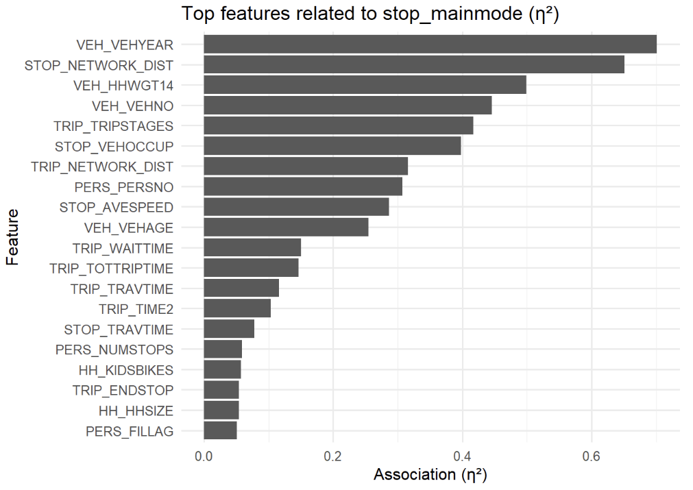
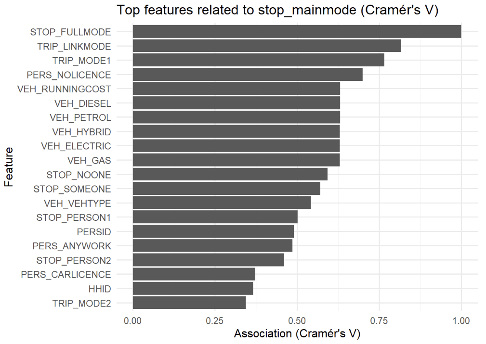
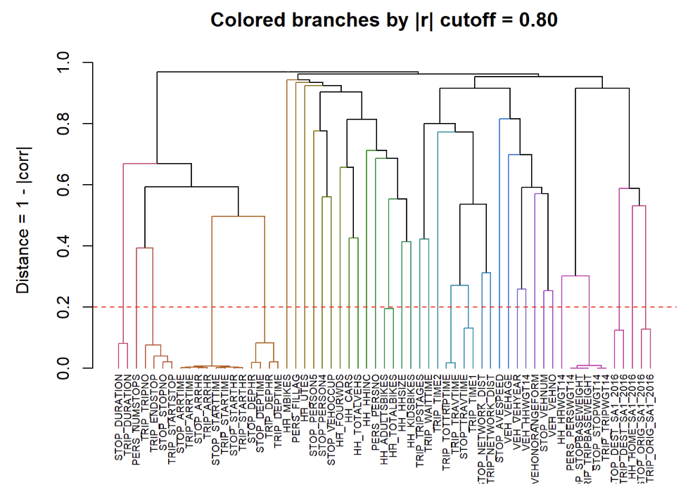

```{r setup, include=FALSE}
knitr::opts_chunk$set(echo = FALSE, warning = FALSE, message = FALSE, fig.align = "center")

# Load required libraries
library(dplyr)
library(ggplot2)
library(knitr)
library(readr)
library(tidyr)
library(scales)

# Set theme for all plots
theme_set(theme_minimal(base_size = 14))
```

## Problem Statement {.build}

**Objective:** Predict travel mode choice on the Gold Coast using household survey data

**Task:** Multi-class classification

- Vehicle Driver / Passenger
- Public Transport (Train, Bus, Ferry)
- Active Transport (Walking, Bicycle)

**Why it matters:**

- Support sustainable transport planning
- Inform infrastructure investment decisions
- Enable targeted policy interventions

## Initial Dataset

<div class="columns-2" style="font-size: 24px; line-height: 1.8;">

<div>
<div style="font-size: 24px; font-weight: 700; color: #E74C3C; margin-bottom: 15px;">Dataset Overview</div>

- <span style="color: #E74C3C; font-weight: 700;">Source:</span> 2015 Gold Coast Survey
- <span style="color: #E74C3C; font-weight: 700;">Size:</span> 22,587 observations
- <span style="color: #E74C3C; font-weight: 700;">Variables:</span> 179 → 163
</div>

<div>
<div style="font-size: 24px; font-weight: 700; color: #E74C3C; margin-bottom: 15px;">Key Challenges Identified</div>

- <span style="color: #E74C3C; font-weight: 700;">Missing values:</span> Up to 99%
- <span style="color: #E74C3C; font-weight: 700;">Class imbalance:</span> 80%+ vehicle
- <span style="color: #E74C3C; font-weight: 700;">Outliers:</span> 20+ variables >1%
- <span style="color: #E74C3C; font-weight: 700;">Data leakage:</span> Vehicle attributes
</div>

</div>

## Exploratory Data Analysis

```{r week7-class-distribution, fig.height=5.5, fig.width=10}
# Actual class distribution from Week 7 dataset (STOP_MAINMODE)
mode_data <- data.frame(
  Mode = c("Vehicle Driver", "Vehicle Passenger", "Walking", "Bicycle",
           "Public Bus", "School Bus", "Train", "Other",
           "Ferry", "Motorcycle", "Taxi", "Plane", "Other Bus"),
  Count = c(13176, 5146, 2919, 303, 247, 223, 194, 164, 79, 73, 42, 13, 8),
  Percentage = c(58.30, 22.80, 12.90, 1.30, 1.10, 1.00, 0.90, 0.70, 0.30, 0.30, 0.20, 0.10, 0.04)
)

ggplot(mode_data, aes(x = reorder(Mode, -Count), y = Count, fill = Mode)) +
  geom_col(width = 0.7) +
  geom_text(aes(label = paste0(Percentage, "%")), vjust = -0.5, size = 3.5, fontface = "bold") +
  scale_fill_manual(values = rep(RColorBrewer::brewer.pal(12, "Set3"), length.out = 13)) +
  scale_y_continuous(limits = c(0, 14000), expand = expansion(mult = c(0, 0.05))) +
  labs(title = "Travel Mode Distribution (All 13 Classes)",
       x = "Mode", y = "Number of Trips") +
  theme(axis.text.x = element_text(angle = 45, hjust = 1, size = 10),
        axis.text.y = element_text(size = 11),
        axis.title = element_text(size = 12),
        plot.title = element_text(size = 15, face = "bold"),
        legend.position = "none",
        plot.margin = margin(5, 20, 5, 10))
```

<div style="font-size: 18px; margin-top: -10px;">
**Key Finding:** Severe class imbalance - dominant vehicle usage requires careful handling
</div>
## EDA: Feature-Target Correlation

```{r eda-correlation, out.width="70%", fig.align="center"}

```

<div style="font-size: 18px; margin-top: 10px;">
**Finding:** Vehicle features (VEH_VEHYEAR, STOP_NETWORK_DIST) show strongest correlation with travel mode
</div>
## EDA: Categorical Features

```{r eda-categorical, out.width="70%", fig.align="center"}

```

<div style="font-size: 18px; margin-top: 10px;">
**Finding:** STOP_FULLMODE, VEH_RUNNINGCOST, PERS_NOLICENCE strongly associated with mode choice
</div>
## EDA: Feature Collinearity

```{r eda-collinearity, out.width="70%", fig.align="center"}

```

<div style="font-size: 18px; margin-top: 10px;">
**Finding:** High multicollinearity detected among vehicle attributes (hierarchical clustering)
</div>
## Key Findings from EDA

**Top Predictive Features (from EDA)**

- **Numerical (η²):** Vehicle characteristics dominated
  - `VEH_VEHYEAR`, `STOP_NETWORK_DIST`, `VEH_HHWGT14`

- **Categorical (Cramér's V):** Strong associations found
  - `STOP_FULLMODE` (1.0 - data leakage!)
  - `PERS_NOLICENCE`, `VEH_RUNNINGCOST`

**Key Insight:** Vehicle proxies dominated predictions → Need to remove for real-world applicability

## Feature Selection & Engineering

<div style="font-size: 18px; line-height: 1.7;">

<div style="background-color: #ECF0F1; padding: 15px; margin-bottom: 20px; border-left: 5px solid #3498DB;">
<span style="color: #E74C3C; font-weight: 700; font-size: 18px;">EDA Insight:</span>
<span style="font-size: 18px;">Vehicle attributes dominated predictions - these are direct proxies that reveal the answer</span>
</div>

<div style="margin-top: 20px; margin-bottom: 15px;">
<span style="color: #E74C3C; font-weight: 700; font-size: 20px;">Our Approach:</span>
</div>

<div style="margin-top: 10px;">

**❌ Removed 81 variables (163 → 92 columns)**

- 25 vehicle proxies (VEH_VEHTYPE, fuel types - reveal the answer)
- 54 administrative variables (person IDs, timestamps - don't affect travel choice)
- 2 low-value variables (94% identical values - no variation to learn from)

**➕ Added 9 engineered features**

- VEH_PER_PERSON, VEH_PER_ADULT (household vehicle availability)
- TRIP_SPEED, TIME_PERIOD, IS_WEEKEND (trip timing characteristics)
- DIST_CATEGORY, HAS_LICENSE_AND_CAR (travel capability indicators)

</div>

</div>
## Feature Selection & Engineering: Visual Summary

```{r preprocessing-summary, fig.height=4.5, fig.width=10}
# Before/After comparison - focus on data leakage removal
preprocessing_data <- data.frame(
  Dataset = rep(c("Initial Dataset", "After Cleaning"), each = 2),
  Category = rep(c("Total Variables", "Vehicle Proxies"), 2),
  Count = c(163, 25,  # Before: 163 total, 25 proxies
            92, 0)     # After: 92 total, 0 proxies (removed 81 total, added 9)
)

ggplot(preprocessing_data, aes(x = Category, y = Count, fill = Dataset)) +
  geom_col(position = "dodge", width = 0.7) +
  geom_text(aes(label = Count), position = position_dodge(width = 0.7),
            vjust = -0.5, size = 5, fontface = "bold") +
  scale_fill_manual(values = c("Initial Dataset" = "#E74C3C",
                                 "After Cleaning" = "#27AE60")) +
  scale_y_continuous(limits = c(0, 180), expand = expansion(mult = c(0, 0.05))) +
  labs(y = "Number of Variables", x = NULL) +
  theme(legend.position = "top",
        legend.title = element_blank(),
        legend.text = element_text(size = 14),
        axis.text = element_text(size = 12),
        axis.title = element_text(size = 13),
        plot.title = element_text(size = 16, face = "bold"))
```

<div style="font-size: 16px; color: #7F8C8D; margin-top: -5px;">
*Chart shows vehicle proxy removal; also removed 56 variables irrelevant to travel choice (survey IDs, timestamps, low-variance)*
</div>

<div style="font-size: 18px; margin-top: 10px;">
<span style="color: #E74C3C; font-weight: 700; font-size: 18px;">Key Distinction:</span> <span style="font-size: 18px;">Kept `HH_CARS` (availability) ✓ | Removed `VEH_VEHTYPE` (usage) ✗</span>
</div>
## Model Selection

<div style="font-size: 18px; line-height: 1.7;">

<div style="font-size: 22px; font-weight: 700; color: #2C3E50; margin-bottom: 10px;">
Selected Models: Random Forest, XGBoost, GLM-NET, SVM, Decision Tree
</div>

<div style="margin-top: 20px;">

<div style="font-size: 20px; font-weight: 700; color: #E74C3C; margin-bottom: 10px;">Why These 5 Models?</div>

<div style="margin-top: 10px;">

- **Diverse Approaches:** Tree-based (RF, XGBoost, DT), Linear (GLM-NET), Kernel-based (SVM)
- **Handle Class Imbalance:** All support class weighting or rebalancing techniques
- **Interpretability vs Performance:** From simple (Decision Tree) to complex (XGBoost)
- **Industry Standard:** Widely used for multi-class classification in transport research

</div>

</div>

</div>
## Experimental Setup & Evaluation Metrics

<div style="font-size: 22px; line-height: 1.8;">

<div style="margin-top: 20px;">

- **Dataset:** 22,587 trips, 92 features, 13 travel modes
- **Train/Test Split:** 80/20 ratio with stratified sampling
- **Cross-Validation:** 5-fold CV, stratified by target class
- **Optimization Metric:** Macro-F1 score

</div>

<div style="font-size: 20px; font-weight: 700; color: #E74C3C; margin-top: 30px; margin-bottom: 15px;">Evaluation Metrics</div>

<div style="margin-top: 10px;">

- **Accuracy:** Overall correct predictions
- **Macro-Precision:** Average precision across all modes (equal weight per class)
- **Macro-Recall:** Average recall across all modes (equal weight per class)
- **Macro-F1:** Harmonic mean of Macro-Precision and Macro-Recall

</div>

<div style="margin-top: 12px; font-size: 18px; background-color: #FDF3E7; padding: 10px; border-left: 5px solid #FF9800;">
**Why Macro-averaging?** Equal weight to all modes, preventing 80%+ vehicle class dominance.
</div>

</div>
## Model Implementation: Preprocessing Strategy

<div style="font-size: 22px; line-height: 1.8;">

<div style="margin-top: 20px;">

- **Random Forest:** Native categorical handling (no encoding needed)

- **XGBoost:** Mixed encoding for efficiency
  - High cardinality (>50 levels): Target encoding
  - Low cardinality (≤50 levels): One-hot encoding

- **Decision Tree:** One-hot encoding (required for high-cardinality features)

- **GLM-NET & SVM:** One-hot encoding + scaling (required for numeric operations)

</div>

<div style="margin-top: 12px; font-size: 18px; color: #27AE60; background-color: #E8F8F5; padding: 12px; border-left: 5px solid #27AE60;">
**Data Leakage Prevention:** All encoders/scalers fitted within each CV fold (never on full data).
</div>

</div>
## Model Implementation: Hyperparameter Optimization

<div style="font-size: 22px; line-height: 1.8;">

<div style="margin-top: 20px;">

- **Random Forest:** Grid search (mtry, min_n, trees) with class weighting

- **XGBoost:** Gradient boosting with Bayesian optimization (22 iterations)

- **GLM-NET:** Elastic net regularization with Bayesian optimization

- **SVM:** RBF kernel with Grid search (cost, gamma)

- **Decision Tree:** Bayesian optimization (22 iterations) with complexity tuning

</div>

<div style="margin-top: 30px; font-size: 20px; color: #2C3E50;">

**Optimization Approach:** All models use 5-fold cross-validation to find hyperparameters that maximize Macro-F1 score

</div>

<div style="margin-top: 12px; font-size: 18px; color: #27AE60; background-color: #E8F8F5; padding: 12px; border-left: 5px solid #27AE60;">
**Data Leakage Prevention:** Class weights calculated within each CV fold (never on full training data).
</div>

</div>
## Model Evaluation: Performance Comparison

<div style="font-size: 14px; margin-bottom: 10px; color: #7F8C8D; font-style: italic;">
Metric focus: Macro-F1 due to class imbalance (accuracy can be inflated).
</div>

```{r model-performance, fig.height=4.6, fig.width=10}
# ACTUAL model performance results from optimization logs
model_results <- data.frame(
  Model = c("Random Forest", "XGBoost", "GLM-NET", "SVM", "Decision Tree"),
  Accuracy = c(0.9258, 0.9357, 0.9052, 0.7702, 0.8862),
  `Macro-F1` = c(0.7153, 0.8298, 0.6225, 0.5031, 0.4311),
  `Macro-Precision` = c(0.9410, 0.8360, 0.7297, 0.5762, 0.4462),
  `Macro-Recall` = c(0.6147, 0.8558, 0.5890, 0.2438, 0.4266),
  check.names = FALSE
)

# Reshape for plotting
model_metrics <- model_results %>%
  pivot_longer(cols = c(Accuracy, `Macro-F1`, `Macro-Precision`, `Macro-Recall`),
               names_to = "Metric",
               values_to = "Score")

# Grouped by Metric - x-axis = Metric, colored bars = Models
ggplot(model_metrics, aes(x = Metric, y = Score, fill = Model)) +
  geom_col(position = "dodge", width = 0.75) +
  geom_text(aes(label = sprintf("%.2f", Score)),
            position = position_dodge(width = 0.75),
            vjust = -0.3, size = 3.3, fontface = "bold") +
  scale_fill_manual(values = c("XGBoost" = "#E67E22",
                                 "Random Forest" = "#3498DB",
                                 "GLM-NET" = "#9B59B6",
                                 "SVM" = "#E74C3C",
                                 "Decision Tree" = "#1ABC9C")) +
  scale_y_continuous(limits = c(0, 1.05),
                     labels = function(x) sprintf("%.2f", x),
                     expand = expansion(mult = c(0, 0)),
                     breaks = seq(0, 1, 0.25)) +
  labs(x = NULL, y = "Score") +
  theme(legend.position = "top",
        legend.title = element_blank(),
        legend.text = element_text(size = 13),
        axis.text.x = element_text(size = 12),
        axis.text.y = element_text(size = 11),
        axis.title.y = element_text(size = 12),
        plot.margin = margin(5, 15, 5, 5))
```

<div style="font-size: 18px; margin-top: 5px;">
<span style="color: #E74C3C; font-weight: 700; font-size: 18px;">Key Insight:</span> <span style="font-size: 18px;">XGBoost (orange) best overall balance; Random Forest (blue) highest Macro-Precision</span>
</div>
## Best Model Selected: XGBoost

<div style="font-size: 22px; line-height: 1.8;">

<div style="font-size: 20px; font-weight: 700; color: #E74C3C; margin-bottom: 15px;">Optimization</div>

- **Hyperparameter tuning:** Bayesian optimization with 5-fold CV to maximize Macro-F1 (see Appendix for details)

<div style="font-size: 20px; font-weight: 700; color: #E74C3C; margin-top: 25px; margin-bottom: 15px;">Key Findings</div>

- **Balanced performance:** Macro-Precision 0.84 & Macro-Recall 0.86 → Macro-F1 0.83
- **Minority modes:** Remain challenging due to tiny sample sizes; balanced performance still best among models
- **Generalization:** Test Macro-F1 0.83 > CV Macro-F1 0.76
- **Top features:** Distance (9.1%), speed competitiveness (7.0%), station access (5.7%)

</div>
## Conclusion

<div style="font-size: 20px; line-height: 1.7;">

**Key Takeaways:**

- **Imbalance is manageable:** Weighting + Macro-F1
- **Modeling choice matters:** Boosting gave the best balanced performance
- **Policy signal:** Distance, speed competitiveness, and station access drive mode choice

<div style="margin-top: 12px; font-size: 18px; font-style: italic; color: #1A5276; background-color: #EBF5FB; padding: 12px; border-left: 5px solid #2E86C1;">
These findings confirm that our model can predict travelers’ transport modes with reliable accuracy, supporting its use in transport planning and policy evaluation.
</div>

**Impact:** Feature importance reveals actionable patterns for targeted policy interventions:

- **Distance-based transit:** Top predictor (9.1%) → Optimize service for specific trip lengths
- **Speed competitiveness:** Critical factor (7.0%) → Ensure transit is time-competitive
- **Transit-oriented planning:** Infrastructure access matters (5.7%) → Focus improvements near stations

</div>

</div>
## Limitations & Future Directions

<div style="font-size: 20px; line-height: 1.6;">

<div style="font-size: 22px; font-weight: 700; color: #E74C3C; margin-bottom: 12px;">Limitations</div>

- **Insufficient data for rare modes:** Ferry (79 trips), Plane (13 trips), Other Bus (8 trips) - models struggle with <0.3% sample sizes
- **Deployment focus:** Prioritize major modes (Vehicle, Walking, Bus, Train) for reliable policy decisions

<div style="font-size: 22px; font-weight: 700; color: #E74C3C; margin-top: 20px; margin-bottom: 12px;">Future Directions</div>

*Next Steps for Deployment:*

- **Geographic targeting:** Identify suburbs with high mode-shift potential
- **Scenario analysis:** Test interventions (faster buses, new routes) using model predictions
- **Real-world partnership:** Collaborate with Gold Coast transport authority

*Model Enhancements:*

- Collect more data for rare modes; incorporate temporal patterns; integrate real-time factors

</div>
## Questions & Discussion {.flexbox .vcenter}

<div class="centered" style="margin-top: 100px;">

<div style="font-size: 48px; color: #2C3E50; font-weight: 700; margin-bottom: 40px;">
Thank You!
</div>

<div style="font-size: 36px; color: #3498DB; font-weight: 600;">
Any Questions?
</div>

</div>
## Appendix: Optimized Hyperparameters {.smaller}

<div style="font-size: 18px;">

**XGBoost (Best: Macro-F1 = 0.83)**
- `max_depth`: 7, `eta`: 0.31, `subsample`: 1.00, `colsample_bytree`: 0.83, `min_child_weight`: 1.0, `gamma`: 0.00

**Random Forest (Best: Macro-F1 = 0.72)**
- `mtry`: 18, `min_n`: 2, `trees`: 600

**GLM-NET (Best: Macro-F1 = 0.62)**
- `penalty`: 0.000013, `mixture`: 0.36 (more L2 regularization)

**SVM (Best: Macro-F1 = 0.50)**
- `cost`: 4.00, `gamma`: 0.050, CV Macro-F1: 0.27 (±0.01)

**Decision Tree (Best: Macro-F1 = 0.43)**
- `cp`: 0.0001, `max_depth`: 22, `min_split`: 10, `min_bucket`: 25

</div>

**Note:** All models used 5-fold cross-validation for hyperparameter tuning